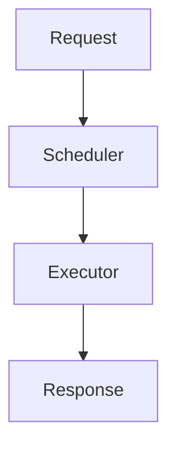

# xTokens 开发与协作规范

## 背景
高效、简洁、易用的LLM推理系统


## 设计文档规范

涉及新功能、架构调整、核心流程变更或复杂性能优化时，必须在实现前编写设计文档。设计文档应与代码一同评审和维护，内容应准确反映最终实现；不再适用的方案和结论应及时更新或标注。

### 文档模板

设计文档应按以下顺序组织。设计文档正文统一使用中文；代码标识符、命令、协议名称和
必要的专有名词可保留英文。各章节应结合具体方案填写，避免只保留占位内容。设计文档
应像一篇面向工程落地的短论文：先说明问题和目标，再说明方案、验证方法和结论。

# 设计文档

## 摘要

- 用一段话概括问题、核心方案、主要收益和验证结果。
- 摘要应足够独立，使读者不阅读全文也能理解本设计的结论。

## 背景

- 说明当前系统状态、适用范围和约束条件。
- 明确现有问题、痛点或需求来源。
- 说明为什么需要该设计，以及预期解决什么问题。

## 目标

- 明确本次要实现的功能与可验证目标。
- 说明预期效果，例如性能、可维护性、稳定性或易用性收益。

## 非目标

- 明确本次设计不解决的问题。
- 记录暂不支持的场景，防止实现范围持续扩大。

## 设计概述

- 描述整体架构和核心模块职责。
- 说明模块之间的数据流、调用关系和依赖边界。

```text
Component A
    ↓
Component B
    ↓
Component C
```

## 详细设计

### 核心流程

描述主要执行流程、关键状态和异常处理。

### 接口与数据结构

描述关键接口、类、数据结构及其约束。

### 类图、时序图与状态图

按复杂度需要添加类图、时序图或状态图，说明关键依赖和交互顺序。

### 兼容性与迁移

- 说明是否改变公开 API、配置格式、数据结构或行为语义。
- 说明旧版本兼容策略、迁移步骤和必要的回滚方式。
- 如存在破坏性变更，明确记录 `BREAKING CHANGE`。

## 测试与评估

- 功能正确性测试。
- 单元测试 / 集成测试。
- 性能 Benchmark（性能相关改动必须提供）。
- 异常场景测试。
- 兼容性 / 迁移测试（接口、配置或数据格式变化时提供）。

测试内容应与本次改动的风险和目标匹配，不要求每个设计都提供 Benchmark。

## 权衡与已知问题

### 优势

- 优点 1
- 优点 2

### 局限

- 缺点 1
- 已知限制

### 方案权衡

说明选择当前方案的原因，以及相较备选方案的取舍。

## 结论

- 总结最终选择的方案及其主要收益。
- 说明实现完成状态、验证结果和仍待解决的问题。

## 完成标准

- 设计文档与最终实现保持一致。
- 相关测试、静态检查和必要的 Benchmark 已完成。
- 文档中的接口、类名、模块名和流程图名称与代码一致。
- 已知限制、兼容性影响和未完成项已明确记录。

### Mermaid 要求

- 正式流程图、类图、时序图和状态图应直接嵌入 Markdown 的 `mermaid` 代码块，并保证可渲染。
- 图中的模块、类、接口和步骤名称应与设计文档及代码中的名称保持一致。
- 复杂 pipeline 应按职责拆分为多张图，避免单图包含过多节点或交叉连线。



## Commit 规范

遵循 [Conventional Commits](https://www.conventionalcommits.org/zh-hans/) 格式：

```
<type>(<scope>): <subject>
```

### 合法 type

| type | 用途 | 示例 |
|------|------|------|
| `feat` | 新增功能 | `feat(engine): support continuous batching` |
| `fix` | 修复 bug | `fix(kernel): fix attention mask out-of-bounds` |
| `docs` | 仅文档变更 | `docs: update README architecture` |
| `refactor` | 代码重构，不改变外部行为 | `refactor(sampler): extract base sampler class` |
| `test` | 增加/修改测试 | `test(tokenizer): add BPE merge cases` |
| `perf` | 性能优化（推理引擎核心关注点） | `perf(kernel): use CUDA Graph to cut launch overhead` |
| `build` | 构建系统或外部依赖变更 | `build: upgrade torch to 2.6` |
| `ci` | CI 配置与脚本变更 | `ci: add GPU unit test job` |
| `style` | 格式调整，不影响逻辑 | `style: unify header include order` |
| `chore` | 杂项维护（非 src/test 的改动） | `chore: update .gitignore` |
| `revert` | 回滚某次提交 | `revert: roll back continuous batching` |

### type 怎么选（重点：perf vs refactor vs feat）

按**这次改动的主要目的**选 type，而不是按 diff 长什么样：

- 目的是**让代码更好读/好维护**，行为不变 → `refactor`
- 目的是**更快/更省内存**，行为不变 → `perf`（哪怕 diff 看起来像重构）
- 目的是**新增用户可见能力**，行为变化 → `feat`（提速不算新功能，新增开关/API 才算）

重叠时按主要意图选一个，次要效果写进 body。例如：重构调度器顺带提速 → `refactor(engine): refactor scheduler`，body 里注明吞吐提升。

### scope（可选，建议使用）

模块名放在括号内，便于按模块过滤历史：

- `engine`：调度/执行主流程
- `kernel`：CUDA kernel
- `model`：模型结构与权重加载
- `tokenizer`：分词器
- `sampler`：采样逻辑
- `kv-cache`：KV cache 管理
- `quant`：量化
- `server`：HTTP/API 层
- `cli`：命令行入口
- `docs` / `ci` / `build`

### subject 要求

- **全部用英文（纯 ASCII）**：subject 和 body 都避免非 ASCII 字符，防止终端乱码（中文说明写进 PR 描述或代码注释）
- 用祈使句（如 `add`、`fix`），不要用过去式（`added`、`fixed`）
- 首字母小写，不超过 50 字符，结尾不加句号

### 完整 commit message 结构

```text
<type>(<scope>): <subject>

<body>        # 解释为什么这么做、怎么做的
<footer>      # 破坏性变更 / 关联 issue
```

- **破坏性变更**：type 后加 `!`（如 `feat!: ...`），并在 footer 中写 `BREAKING CHANGE: ...`
- 一次 commit 只做一件事，避免混入无关改动

### 常用命令

```bash
git commit -m "feat(engine): support continuous batching"
git commit -m "fix(kernel): fix attention mask out-of-bounds" -m "pass seq_len explicitly instead of implicit inference"
```

## 分支约定

- `main`：稳定分支，始终可构建
- `feat/<描述>` / `fix/<描述>`：功能与修复分支

## 代码风格

- C++（kernel 层）：遵循项目 clang-format 配置
- Python（engine/server 层）：遵循 PEP 8，用 ruff 检查
- 新增代码需附带对应 `test/` 用例
