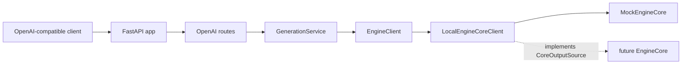
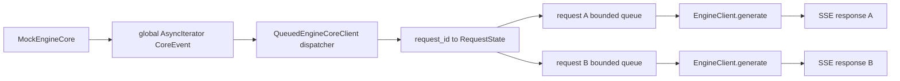
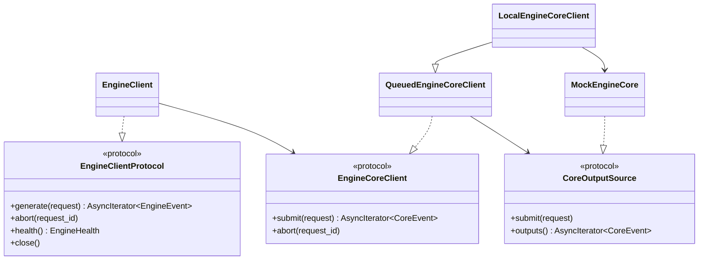
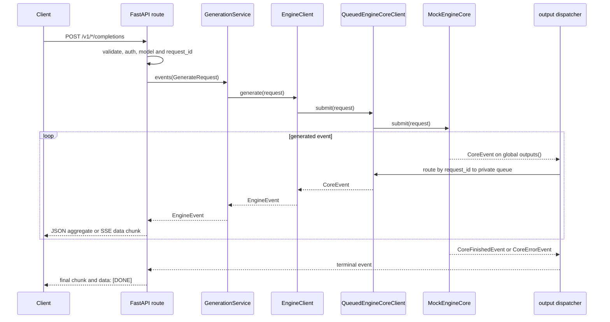

# xTokens Serve API 设计

## 1. 背景

xTokens 需要一个 OpenAI-compatible HTTP 服务入口，提供模型发现、completion 和 chat
completion 接口。Serve 层负责 HTTP、SSE 与 OpenAI 协议转换；它不应参与模型执行、调度、
continuous batching、KV cache 或 CUDA 资源管理。

当前尚未实现真实 `EngineCore`。为了先验证 Serve API 的协议、异步流、取消和 backpressure，
默认运行时使用不依赖 GPU 的 `MockEngineCore`。它保留未来真实 Core 所需的 producer 形状：请求经
`submit()` 进入 Core，输出从唯一的 `outputs()` 全局异步流返回。

预期收益：Serve 协议可独立于推理引擎迭代；HTTP 测试无需模型或 GPU；真实本地 Core 或 RPC
transport 接入时无需重写路由和 OpenAI adapter。

## 2. 目标 / 非目标

### 目标

- 提供 `GET /live`、`GET /ready`、`GET /v1/models`、`POST /v1/completions` 和
  `POST /v1/chat/completions`。
- 支持 OpenAI-compatible 流式与非流式生成、`X-Request-ID`、usage、基础 sampling 参数、API key、
  CORS、请求大小限制和标准错误 envelope。
- 使用 `text/event-stream` 实现 SSE；首个 `ErrorEvent` 在响应开始前返回 JSON error，响应开始后
  返回 SSE error event，再以 `data: [DONE]` 结束。
- 每个请求使用唯一 `request_id`，将 Core 全局输出按 ID 分发到私有有界队列；慢 SSE consumer
  不得阻塞其他请求。
- 客户端断连、超时和应用关闭最终调用幂等的 `abort(request_id)`。
- `entrypoints/serve` 只依赖 `EngineClientProtocol`，`engine` 不依赖 FastAPI 或 OpenAI HTTP DTO。

### 非目标

- 真实 `EngineCore`、scheduler、continuous batching、KV cache、模型加载和 CUDA 执行。
- RPC/multiprocess transport、多个 Web worker 共享 Engine。
- 多模型动态加载、LoRA、prefix cache、profiling 等控制面 API。
- 完整 OpenAI API、tool call、多模态 content、reasoning content 和模型专用 chat template。
- 指标 exporter、trace、Engine request log 和性能基准实现。

## 3. 整体设计

### 架构图

当前默认路径使用 mock；虚线为未来真实 Core 的替换点。



依赖方向为 `entrypoints/serve -> engine -> CoreOutputSource contract`。未来 Core 实现依赖该
contract，但不依赖 `entrypoints/serve`、FastAPI 或 OpenAI DTO。

### 核心模块

| 模块 | 当前职责 |
| --- | --- |
| `x_tokens/entrypoints/serve/app.py` | `create_app()`、lifespan、CORS、body size 和 exception handler |
| `entrypoints/serve/openai` | OpenAI Pydantic DTO、路由、request/response adapter、SSE 编码 |
| `entrypoints/serve/generation.py` | ready gate、活动请求、取消和 shutdown 策略 |
| `entrypoints/serve/models.py` / `renderer.py` | 单模型注册表与纯文本 chat prompt 渲染 |
| `x_tokens/engine/client.py` | `EngineClientProtocol` 与默认 `EngineClient`，`CoreEvent` 到 `EngineEvent` 归一化 |
| `x_tokens/engine/core_client.py` | Core contract、请求注册表、私有队列、全局 output dispatcher 和 `DispatchMetrics` |
| `x_tokens/engine/clients/local.py` | `MockEngineCore` 与 `LocalEngineCoreClient` |

默认 CLI 为：

```bash
python -m x_tokens --model x-tokens-mock --port 8000
```

`ServeConfig.engine_mode` 当前仅允许 `local`。`--output-queue-size` 控制每个请求的输出队列容量，
默认值为 32。

### 数据流

`MockEngineCore` 为每个 `submit()` 启动独立 producer task，但只暴露一个全局输出流。唯一的
`QueuedEngineCoreClient` dispatcher 消费该流，并以 `request_id` 路由到请求私有队列。



这样 SSE 连接只消费自身请求的事件；Core producer 和 dispatcher 不等待任何单个 HTTP 客户端。

## 4. 详细设计

### 接口与数据结构

HTTP DTO 在 `entrypoints/serve/openai/protocol.py`，进入 Engine 前转换为与 HTTP 无关的
`GenerateRequest` 和 `SamplingParams`。Core 输出与 Serve 输出分开建模，避免 Core 依赖 OpenAI。

```python
@dataclass(frozen=True, slots=True)
class GenerateRequest:
    request_id: str
    model: str
    prompt: str | tuple[int, ...]
    sampling: SamplingParams
    priority: int = 0
    metadata: dict[str, Any] = field(default_factory=dict)


EngineEvent = TokenEvent | FinishedEvent | ErrorEvent
CoreEvent = CoreTokenEvent | CoreFinishedEvent | CoreErrorEvent
```

`FinishedEvent` 包含 `FinishReason`、prompt token 数和 completion token 数；adapter 用这些值生成
usage。`ErrorEvent` 是终止事件。正常请求应产生一个 `FinishedEvent`，其后不再产生 token。

核心接口如下：

```python
class EngineClientProtocol(Protocol):
    def generate(self, request: GenerateRequest) -> AsyncIterator[EngineEvent]: ...
    async def abort(self, request_id: str) -> None: ...
    async def health(self) -> EngineHealth: ...
    async def close(self) -> None: ...


class EngineCoreClient(Protocol):
    def submit(self, request: GenerateRequest) -> AsyncIterator[CoreEvent]: ...
    async def abort(self, request_id: str) -> None: ...
    async def health(self) -> EngineHealth: ...
    async def close(self) -> None: ...


class CoreOutputSource(Protocol):
    async def submit(self, request: GenerateRequest) -> None: ...
    def outputs(self) -> AsyncIterator[CoreEvent]: ...
    async def abort(self, request_id: str) -> None: ...
    async def health(self) -> EngineHealth: ...
    async def close(self) -> None: ...
```

`EngineClientProtocol` 是 Serve 的依赖注入边界。默认 `EngineClient` 实现它，测试可直接注入
Fake Engine。`CoreOutputSource` 是未来真实本地 Core 或 RPC transport 必须实现的 producer contract。



### 请求流程

流式和非流式请求共用 `EngineClient.generate()`。区别仅在 adapter：流式请求逐事件写入 SSE，
非流式请求聚合 token text 后一次性返回 JSON。



路由首先检查 API key 和模型 ready 状态，并从 `X-Request-ID` 读取 ID；没有 header 时分别生成
`cmpl-*` 或 `chatcmpl-*`。chat 路由先通过 `PlainTextPromptRenderer` 将消息按
`"{role}: {content}"` 行拼接，再创建 `GenerateRequest`。

### SSE、错误和取消

SSE 由 `encode_sse()` 编码，每条消息为 `data: <json>\n\n`，并设置 `Cache-Control: no-cache`、
`Connection: keep-alive` 和 `X-Accel-Buffering: no`。结束标识为 `data: [DONE]`；
`stream_options.include_usage=true` 时，在完成事件后追加 usage chunk。

| 场景 | 行为 |
| --- | --- |
| 第一个 Engine event 是错误 | 返回 JSON OpenAI error，不创建 SSE 响应 |
| SSE 已开始后发生错误 | 写入 SSE error，再写入 `[DONE]` |
| 非流式 Engine error | 返回 OpenAI error |
| 请求超时 | 非流式返回 504；流式返回 SSE timeout error 和 `[DONE]` |
| 客户端断连或 generator 提前关闭 | `GenerationService` 在 `finally` 调用 `abort(request_id)` |
| shutdown | 按 `abort` 或 `drain` 策略停止活动请求，再关闭 Engine |

`abort()` 必须幂等。当前 disconnect 在每次事件发送前检测；这样能终止持续产生输出的请求。

### Backpressure 与生命周期

`QueuedEngineCoreClient` 的 `RequestState` 持有有界 `asyncio.Queue[CoreEvent]`、terminal 状态和
terminal delivery task。普通 token 使用 `put_nowait()`；队列满时 dispatcher 标记请求 terminal、
异步调用 Core `abort(request_id)`，等待队列重新可写后投递 `CoreErrorEvent`。其他请求仍继续分发。

`DispatchMetrics` 在内存中记录：`active_requests`、`unknown_request_events`、
`slow_consumer_cancellations` 和 `output_queue_blocked_seconds`。完成、错误、abort 和关闭都会删除
对应注册表项。

应用通过 `create_app()` 的 lifespan 创建 `EngineClient(LocalEngineCoreClient(...))`、模型注册表和
service。`/live` 仅检查 Web 进程；`/ready` 调用 `EngineClient.health()`，当前 mock 在未关闭时 ready。
关闭时先停止 service 接收工作，`drain` 等待到 timeout 后取消，`abort` 立即取消，最后关闭共享
`EngineClient` 与 `MockEngineCore`。真实 Core 接入后，其 `close()` 还需要负责 worker、模型和 KV cache。

## 5. 测试与验证

测试不依赖 GPU。当前测试集共 14 个测试，覆盖：

- `tests/entrypoints/serve/test_app.py`：request ID、OpenAI validation error、API key、ready gate、
  shutdown、chat SSE、流中 Engine error 与提前关闭的 abort。
- `tests/engine/test_core_client.py`：交错 Core 输出的 request ID 分流、慢 consumer 取消、其他请求
  继续推进、Core 输出流失败、重复 abort、注册表清理和 `CoreEvent -> EngineEvent` 归一化。
- `benchmarks/test_serve/tests`：模型发现和 OpenAI chat SSE 解析。

执行：

```bash
uv run ruff check x_tokens tests
uv run ruff format --check x_tokens tests
uv run pytest -q tests benchmarks/test_serve/tests
uv build
```

最小手工验证：

```bash
python -m x_tokens --model x-tokens-mock --port 8000
curl http://127.0.0.1:8000/v1/models
curl -N http://127.0.0.1:8000/v1/completions \
  -H 'Content-Type: application/json' \
  -d '{"model":"x-tokens-mock","prompt":"hello","stream":true}'
```

验收条件：非流式请求返回 OpenAI-compatible JSON 和 usage；流式响应是有效 SSE 且以 `[DONE]` 结束；
多个请求的输出不串流；慢客户端只影响自身；未完成请求最终触发 abort；`/ready` 在 Engine 不 ready 时返回
503。

## 6. Trade-offs / 已知问题

- 当前 `MockEngineCore` 只按固定文本分词输出，不执行真实 tokenization、sampling 或模型推理；它验证
  transport 行为，不代表真实推理性能或 token 语义。
- 当前只有 in-process `local` mode，没有 RPC、进程监控、transport 版本协商或 Web/Core 独立故障恢复。
- 每个请求一个有界队列，选择了隔离性而不是等待慢客户端；满队列会取消该请求。容量由
  `output_queue_size` 控制，需要在内存占用和慢消费者容忍度之间权衡。
- dispatcher metrics 仅存在进程内，尚未接入 Prometheus、日志或 trace；TTFT、ITL、E2EL 等性能指标
  尚未采集。
- `PlainTextPromptRenderer` 不是模型专用 chat template。真实 tokenizer 接入后应替换 renderer，
  并明确 token ID、stop token 和多模态输入边界。
- `request_timeout_s` 约束 Serve 层等待时间；真实 Core 必须确保 abort 能释放 scheduler 请求、执行资源和
  KV cache。
- 本地真实 Engine 接入后，一个 Uvicorn worker 会拥有一份模型；应限制为单 Web worker，避免重复加载
  导致 GPU OOM。
