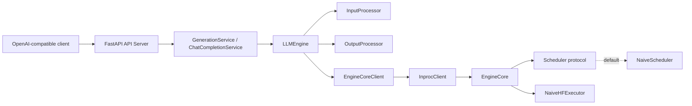
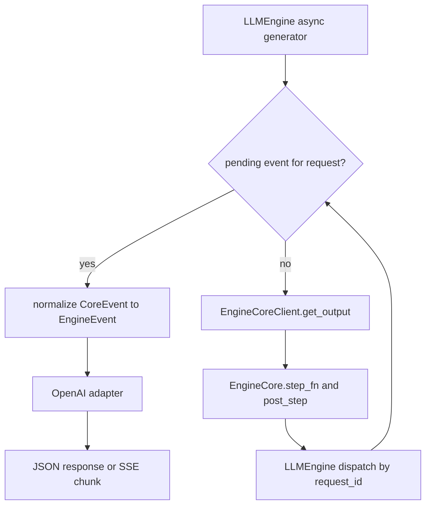
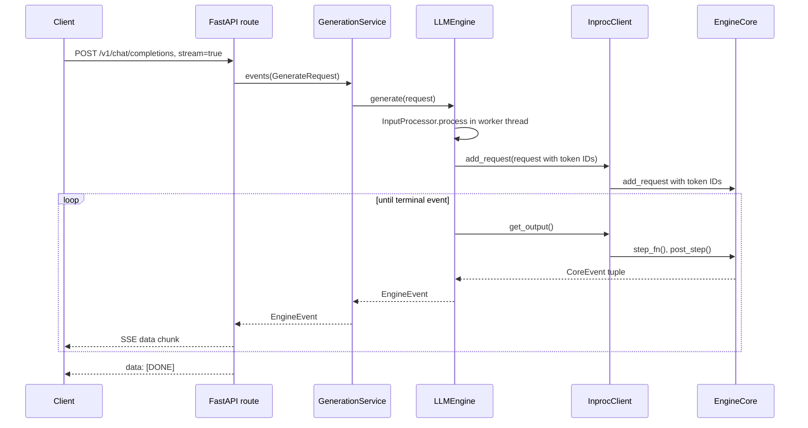
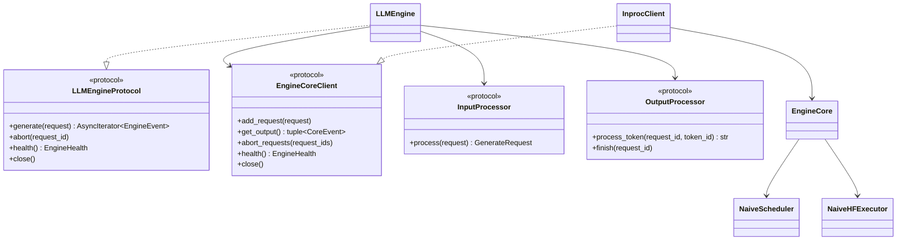
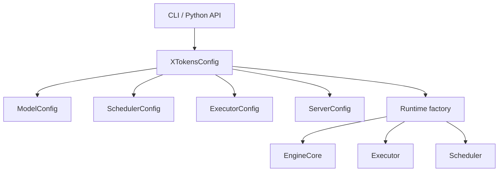
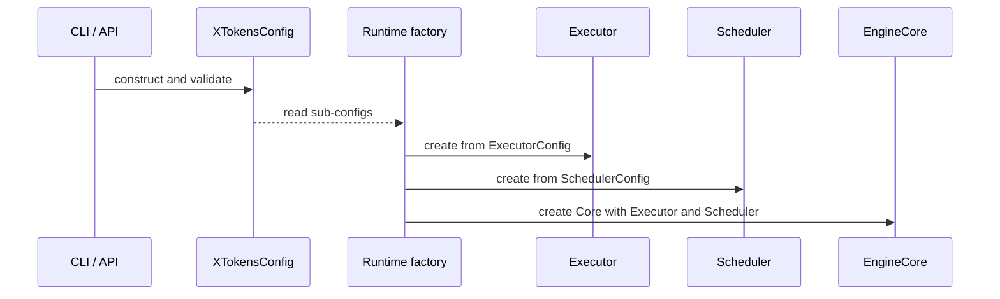

# 设计文档：OpenAI-Compatible Serve API

## 摘要

xTokens Serve 提供 OpenAI-compatible 的模型发现、completion、chat completion、JSON 和 SSE 响应。
实现将 HTTP 协议处理、异步引擎编排、token 处理、Core 调度和模型执行分离。当前运行时采用
单进程 `InprocClient` 路径，并支持注入 scheduler 和 executor factory。测试覆盖 HTTP contract、
流生命周期、取消和 Core 集成；使用真实模型启动时还需要可访问的 Hugging Face 模型。

## 背景

xTokens 提供 OpenAI-compatible HTTP 服务，以暴露模型发现、text completion 与 chat completion
能力。Serve 层负责 HTTP 请求处理、OpenAI DTO 转换、SSE 编码和应用生命周期；模型执行、调度和
请求状态归属于 Engine/Core 层。

当前实现已具备单进程的 Hugging Face 执行路径。旧设计中基于 `MockEngineCore`、全局异步输出流、
私有有界队列及 dispatcher 的描述已经不适用。当前重构将输入预处理从 `EngineCore` 移至
`LLMEngine`：Engine 通过 `InputProcessor` 将文本或 token IDs 规范化为 token IDs，再经同步的
`EngineCoreClient` 驱动 `InprocClient` 与 `EngineCore`。

该分层使 OpenAI API 与 Core 的执行实现解耦，同时为后续替换为进程间或远程的
`EngineCoreClient` transport 保留边界。

## 目标

- 提供 `GET /live`、`GET /ready`、`GET /v1/models`、`POST /v1/completions` 与
  `POST /v1/chat/completions`。
- 以 `LLMEngineProtocol` 作为 Serve 到 Engine 的依赖边界，以 `EngineCoreClient` 作为 Engine
  到 Core/transport 的边界。
- 支持 OpenAI-compatible 的流式 SSE 与非流式 JSON 响应、usage、基础 sampling 参数、API key、
  CORS、请求体大小限制和 OpenAI error envelope。
- 用 async generator 将 Engine 事件逐个转换并传给 FastAPI `StreamingResponse`；流式响应以
  `data: [DONE]` 结束。
- 在客户端断连、请求提前关闭或应用退出时取消未完成的 Core 请求。
- 将 chat template、tokenization、token-ID 输入校验和 token 增量解码放在 Engine 输入处理边界；
  `EngineCore` 只接收 token IDs 并执行调度与模型前向。
- 当前范围限于单进程、单个已加载模型的 HF Core 路径；不包含 RPC transport、多 worker 模型共享、
  LoRA、多模态或完整 OpenAI API。

## 非目标

- 不实现独立 Core worker、IPC/RPC transport 或多 worker 模型共享。
- 不实现 KV cache、prefix cache、优先级调度、抢占、LoRA、多模态和完整 OpenAI API。
- 不把 HTTP/OpenAI DTO、SSE 或 tokenizer 逻辑下沉到 `EngineCore`。

## 整体设计

### Architecture and Responsibilities



| 模块 | 职责 |
| --- | --- |
| API Server | 在 `app.py` 创建 FastAPI app、初始化依赖、配置 CORS/请求体限制和异常处理。 |
| OpenAI routes/adapter | 校验 HTTP DTO、鉴权、生成 request ID、构造响应，并负责 JSON/SSE wire format。 |
| `GenerationService` | 模型准入与 ready gate、活动请求跟踪、异常归一化、取消和 shutdown 策略。 |
| `LLMEngine` | 面向 Serve 的异步生成 facade；异步执行输入预处理、提交 token IDs、按 request ID 暂存/分发 Core 输出。 |
| `InputProcessor` | 在 Engine 侧执行文本 tokenization、已提供 token IDs 的规范化和输入校验。 |
| `OutputProcessor` | 在 Engine 侧维护每请求 detokenization 状态，将生成 token IDs 增量转换为文本，并在请求结束时清理状态。 |
| `EngineCoreClient` | 同步 transport contract。当前 `InprocClient` 直接调用 Core；未来可替换为 IPC/RPC client。 |
| `EngineCore` | 通用的同步推理后端：接收已处理 token IDs，执行 `NaiveScheduler` 调度、调用 executor、生成 token ID/终止事件和资源关闭。 |
| `NaiveHFExecutor` | Hugging Face 的朴素 executor：每 step 对完整上下文执行一次无 KV cache 前向、采样下一个 token ID。 |

依赖方向为 `entrypoints/serve -> engine -> core/executor`。Core 与 Engine 不依赖 FastAPI、
SSE 或 OpenAI DTO。

### Current In-Process Data Flow

`LLMEngine` 首先在 `asyncio.to_thread()` 中调用 `InputProcessor.process()`；这一步生成 token IDs，
不会阻塞 Core 的调度/执行调用。`InprocClient.get_output()` 是 pull 接口：它调用一次 `EngineCore.step_fn()`，然后调用
`post_step()`，并返回 channel `0` 在本 step 产生的 `CoreEvent`。因此当前 Core 没有独立后台
producer、全局 `AsyncIterator`、dispatcher task 或每请求输出队列。

`LLMEngine.generate()` 返回 async generator。某个 generator 需要事件时，它从本地
`_pending_events` 取该 request 的缓存；缓存为空时调用 `get_output()` 推进一个 Core step，按
`request_id` 把该 step 的所有输出分发到 `_pending_events`，再只 yield 当前请求的事件。其他请求
的输出会留在各自的 pending deque 中，等待相应 generator 消费。



`NaiveScheduler` 以 FIFO 将 waiting 请求纳入 running 集合，最多同时运行
`SchedulerConfig.max_num_seqs` 个序列；每次 Core step 对当前 running batch 执行一次模型前向，
并产生每个请求的 token 或终止事件。
它是基础连续批处理实现，但当前没有 KV cache、优先级调度或抢占。

## 详细设计

### 核心流程

#### Request, Scheduling, and Events

1. Route 校验 API key、模型名和 Engine readiness，从 `X-Request-ID` 读取 ID；未提供时生成
   `cmpl-<uuid>` 或 `chatcmpl-<uuid>`。
2. `completion_generate_request()` 或 `chat_generate_request()` 将 OpenAI 请求转换为
   `GenerateRequest`。chat 请求先由 `PlainTextPromptRenderer` 渲染为纯文本 prompt。
3. `GenerationService.events()` 记录活动 request ID，并迭代 `LLMEngine.generate()`。
4. `LLMEngine` 在线程中调用 `InputProcessor.process()`，将文本 prompt 编码为 token IDs，或校验
   已提供的 token IDs。预处理失败变为请求级 `ErrorEvent`，不会进入 Core。
5. `LLMEngine` 调用 `EngineCoreClient.add_request()`；`InprocClient` 直接调用
   `EngineCore.add_request()` 入队。Core 只校验模型名和调度约束，入队失败会变为 `CoreErrorEvent`。
6. Engine 按需调用 `get_output()`。Core 调度 batch、调用 executor、更新 scheduler，并输出
   `CoreTokenEvent`、`CoreFinishedEvent` 或 `CoreErrorEvent`。
7. Engine 调用 `OutputProcessor.process_token()` 将 Core token ID 转为文本，并归一化为
   `TokenEvent`、`FinishedEvent` 或 `ErrorEvent`。终止事件结束该
   request 的 generator；若 generator 在终止前结束，`finally` 调用 `abort_requests()`。
8. `GenerationService.events()` 在请求开始和离开时记录 INFO 生命周期日志。正常完成包含
   finish reason、prompt/completion token 和耗时；错误事件记录 WARNING；超时、断连或调用者提前
   关闭 generator 时记录取消和耗时。日志不记录 prompt 或 chat message 正文。

#### Non-Streaming Responses

Route 使用 `collect_events()` 聚合 `TokenEvent.text`，收到 `FinishedEvent` 后返回一次 JSON 响应
和 usage。`ErrorEvent`、没有终止事件或超时分别转换为 OpenAI error；超时状态码为 504。

#### SSE Streaming Responses

Route 会先预取第一个 Engine 事件。若首事件为 `ErrorEvent`，在 HTTP 响应开始前返回 JSON error；
否则将事件重新放回流中，依次传给 `completion_sse()` 或 `chat_sse()`。二者都是 async generator，
每次 `yield` 已编码的 `data: <json>\n\n` 字符串；`StreamingResponse` 将其写入
`text/event-stream` 响应。



`chat_sse()` 的首个 token chunk 额外携带 `delta.role = "assistant"`；终止 chunk 携带
`finish_reason`。当 `stream_options.include_usage=true` 时，终止 chunk 后、`[DONE]` 前追加一个
`choices: []` 的 usage chunk。SSE 头包括 `Cache-Control: no-cache`、`Connection: keep-alive`
和 `X-Accel-Buffering: no`。

流式期间 `_disconnect_aware()` 在每个事件发送前检查连接状态。`_stream_with_timeout()` 对整个
SSE body 应用 `request_timeout_s`；超时或未处理异常后尽力输出 SSE error event 和 `[DONE]`。
由于 `GenerationService.events()` 的 `finally`，正常完成之外的 generator 关闭路径都会请求取消。

### 接口与数据结构

```python
class LLMEngineProtocol(Protocol):
    def generate(self, request: GenerateRequest) -> AsyncIterator[EngineEvent]: ...
    async def abort(self, request_id: str) -> None: ...
    async def health(self) -> EngineHealth: ...
    async def close(self) -> None: ...

class EngineCoreClient(Protocol):
    def add_request(self, request: GenerateRequest) -> None: ...
    def get_output(self) -> tuple[CoreEvent, ...]: ...
    def abort_requests(self, request_ids: tuple[str, ...]) -> None: ...
    def health(self) -> EngineHealth: ...
    def close(self) -> None: ...
```

```python
class InputProcessor(Protocol):
    def process(self, request: GenerateRequest) -> GenerateRequest: ...
```

```python
class OutputProcessor(Protocol):
    def process_token(self, request_id: str, token_id: int) -> str: ...
    def finish(self, request_id: str) -> None: ...
```

```python
@dataclass(frozen=True, slots=True)
class GenerateRequest:
    request_id: str
    model: str
    prompt: str | tuple[int, ...]
    sampling: SamplingParams
    priority: int = 0
    metadata: dict[str, Any] = field(default_factory=dict)

EngineEvent = TokenEvent | FinishedEvent | ErrorEvent
CoreEvent = CoreTokenEvent | CoreFinishedEvent | CoreErrorEvent
```

`SamplingParams` 当前包含 `max_tokens`、`temperature`、`top_p`、`top_k`、`stop` 和
`ignore_eos`。Completion 与 Chat Completion API 都接受 `ignore_eos`，默认值为 false；开启时
Core 将 EOS 作为普通 token 继续生成，直到 `max_tokens` 或 `max_model_len`。`InputProcessor`
与 Core 都会校验输入；当前不支持 stop string，传入时会产生请求级错误。`FinishedEvent`
携带 prompt/completion token 数和 `FinishReason`，adapter 据此生成 OpenAI usage。



### 生命周期、异常与取消

`create_app()` 的 lifespan 创建一个 Engine、单模型 `ModelRegistry`、completion service 与 chat
service；启动时调用 `refresh_readiness()`。`/live` 只确认 Web 进程存活，`/ready` 调用
`LLMEngine.health()`，`InprocClient` 在未关闭时报告 ready。

`GenerationService` 捕获未预期的 Engine 异常并产出通用 `ErrorEvent`。它跟踪活动 request ID：
正常 `FinishedEvent`/`ErrorEvent` 后不再 abort；断连、超时、consumer 提前关闭等非完成路径会在
`finally` 调用 `LLMEngine.abort()`，随后 Core scheduler 移除 waiting 或 running 请求。`abort` 对
已完成或未知 ID 无副作用。

关闭时，service 先停止接受新工作。`shutdown_policy="abort"` 立即取消活动请求；`"drain"` 最多等待
`shutdown_timeout_s`，超时后再取消。最后 `LLMEngine.close()` 取消其活跃请求并关闭 Core；
`EngineCore.close()` abort 所有 scheduler 请求。

### 兼容性与迁移

公开 HTTP endpoint 保持 OpenAI-compatible。运行时配置使用包含 `ModelConfig`、`SchedulerConfig`、
`ExecutorConfig` 和 `ServerConfig` 的 `XTokensConfig`。扁平的 `ServeConfig` 通过
`to_xtokens_config()` 继续作为兼容适配器保留。自定义运行时实现应通过 executor/scheduler factory
注入，而不是作为实例存入可序列化配置。

## 测试与评估

现有测试覆盖 Serve 与单进程 Core 路径：

- `tests/entrypoints/serve/test_app.py`：模型列表、request ID、验证错误、API key、ready gate、
  shutdown、chat SSE、流式 Engine error 与 generator 提前关闭时的 abort。
- `tests/engine/test_inproc_client.py`：`InprocClient` 与 `EngineCore` 的请求提交、执行、输出及关闭。
- `tests/engine/test_hf_core.py`：`EngineCore` 对已处理 token IDs 的调度、token/finish/error 事件与采样参数校验。
- `tests/engine/test_input_processor.py`：文本和 token-ID prompt 的处理、输入错误，以及 `OutputProcessor` 的增量解码和状态清理。
- `tests/engine/test_scheduler.py`：FIFO 调度、并发序列上限、完成、失败和 abort。

建议执行：

```bash
uv run ruff check x_tokens tests
uv run ruff format --check x_tokens tests
uv run pytest -q tests
uv build
```

最小手工验证：

```bash
python -m x_tokens --model <hf-model-or-alias> --port 8000
curl http://127.0.0.1:8000/v1/models
curl -N http://127.0.0.1:8000/v1/completions \
  -H 'Content-Type: application/json' \
  -d '{"model":"<served-model-name>","prompt":"hello","stream":true}'
```

验收条件：非流式请求返回 OpenAI-compatible JSON 和 usage；流式响应每条事件符合 SSE 格式且以
`[DONE]` 结束；batch 中不同 request ID 的输出不会被错误地交给其他 generator；断连、超时和关闭会
移除未完成 Core 请求。

## 权衡与已知问题

### 优点

- API Server、`LLMEngine`、`EngineCoreClient` 与 `EngineCore` 职责清晰，OpenAI 协议不进入 Core。
- 当前 in-process path 没有序列化、IPC、后台 dispatcher 或队列开销，便于验证 Core 正确性。
- async generator 与 `StreamingResponse` 直接衔接，token 产生后可逐 chunk 发送。

### 限制

- `EngineCoreClient` 是同步 pull 接口；`get_output()` 在调用 Engine 的事件循环线程执行模型 step。
  当前没有独立 Core worker、输出队列或跨请求 backpressure 隔离。
- `LLMEngine` 通过共享 pending event map 路由一个 step 的输出，但没有专用 dispatcher task；多请求的
  推进依赖各 HTTP generator 持续被调度。
- 只有 `InprocClient`，每个 Uvicorn worker 都会加载一份 `NaiveHFExecutor`/模型；生产部署应限制 worker
  数量以避免重复占用 GPU 内存。
- scheduler 不包含 KV cache、prefix cache、优先级、抢占或指标；当前 `stop` string 也未实现。
- 断连检查发生在事件之间；当单次 Core step 很慢时，取消要等该 step 返回才能生效。

### 权衡

当前选择同步 in-process pull transport，以较小的实现复杂度换取可直接验证的 Core/Executor 路径。
当需要 Web 与 Engine 独立扩缩、避免阻塞 Web event loop 或实现更强的慢消费者隔离时，可保持
`LLMEngineProtocol` 不变，将 `EngineCoreClient` 替换为带请求/响应队列的进程内线程、进程间或 RPC
实现；该改动会需要明确输出所有权、背压、取消确认和故障恢复语义。

## 附录：结构化配置

### 配置背景与目标

当前配置需要同时描述 HTTP 服务、模型、executor 和 scheduler。继续在 `ServeConfig` 中添加
`hf_*` 字段会让职责边界变得模糊。本项目采用单一顶层配置 `XTokensConfig`，并按职责拆分子配置。



### 配置结构

所有配置使用 `dataclass(frozen=True, slots=True)`，由构造函数完成必要校验：

```python
@dataclass(frozen=True, slots=True)
class XTokensConfig:
    model_config: ModelConfig
    scheduler_config: SchedulerConfig
    executor_config: ExecutorConfig
    server_config: ServerConfig
```

| 配置 | 职责 |
| --- | --- |
| `ModelConfig` | served model 名称、实际模型路径和 `max_model_len` |
| `SchedulerConfig` | scheduler policy 和 `max_num_seqs` |
| `ExecutorConfig` | executor backend、device、dtype 和本地模型加载选项 |
| `ServerConfig` | HTTP、鉴权、超时、关闭策略和 CORS |

Legacy `ServeConfig.hf_model` 对应 `ModelConfig.model`，legacy
`ServeConfig.hf_max_num_seqs` 对应 `SchedulerConfig.max_num_seqs`，新字段不再携带 backend 前缀。配置对象只保存可序列化数据，
executor/scheduler 实例由 runtime factory 创建。

### 构造与兼容迁移



`ServeConfig` 暂时作为旧 flat API 保留，并通过 `to_xtokens_config()` 转换为新配置。
新代码使用 `XTokensConfig`；Python 嵌入场景可继续通过 runtime factory 注入自定义实现。
当前 registry 支持 `naive_hf` executor 和 `naive` scheduler，未知 backend/policy 在配置
构造时直接报错。后续增加 KV cache、parallel 或 connector 配置时，只需增加对应子配置，
不再扩展 Serve 顶层字段。

### 配置测试

- 子配置默认值和边界校验。
- `XTokensConfig` 组合校验。
- CLI 参数到子配置映射。
- 默认 executor/scheduler 创建及自定义 factory 注入。
- `ServeConfig.to_xtokens_config()` 兼容迁移。

## 结论

当前 Serve 设计提供了可测试的 OpenAI-compatible 接口，同时使 Core 独立于 HTTP 关注点。结构化配置
和 factory 边界为替代 scheduler、executor 和 transport 保留了清晰的扩展点，无需修改 API 层。

## 完成标准

- HTTP routes, JSON/SSE formats, API key handling, timeout, cancellation, and shutdown behavior are covered by tests.
- `XTokensConfig` and its sub-configurations validate their inputs and are used by the default runtime path.
- Design names match the current code: `LLMEngine`, `EngineCoreClient`, `InprocClient`, `SchedulerOutput`, and `NaiveHFExecutor`.
- Known limitations and real-model startup prerequisites are documented.
