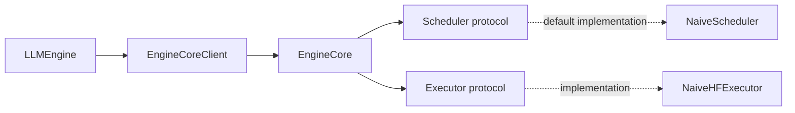
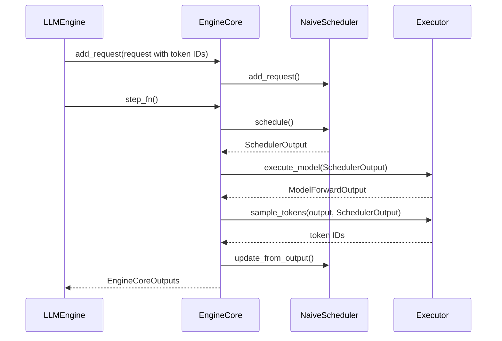
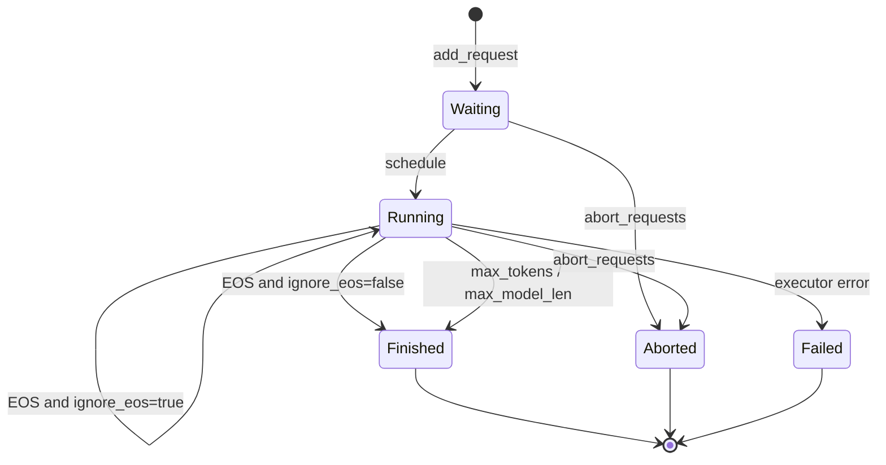

# 设计文档：Token-ID EngineCore

## 摘要

`EngineCore` is a synchronous, backend-independent token-ID execution loop. It validates requests,
delegates admission and lifecycle updates to the injected `Scheduler`, delegates model execution and
sampling to the injected `Executor`, and emits normalized Core events. `NaiveScheduler` is the default
implementation, while the protocol allows future scheduling strategies.

## 背景

`EngineCore` 是 xTokens 的同步推理后端。Serve 与 `LLMEngine` 已在 Core 外完成 chat rendering、tokenization 和输出文本解码；因此 Core 不应依赖 FastAPI、OpenAI DTO、tokenizer 或 Hugging Face 模型实现。

当前需要一个可替换 executor 的最小 Core：它接收稳定的 token-ID 请求，维护请求生命周期和 batch 调度，并将 executor 的下一个 token ID 转为 Core events。

## 目标

- 仅接收 `GenerateRequest.prompt: tuple[int, ...]`，拒绝文本 prompt。
- 负责模型别名和 sampling 参数校验、FIFO 准入、运行状态、取消和关闭。
- 每次 `step_fn()` 至多执行一次 batch forward，并输出 `CoreTokenEvent`、`CoreFinishedEvent` 或 `CoreErrorEvent`。
- 仅依赖 `Executor` protocol，使 `NaiveHFExecutor` 可以替换为其他执行后端。

不包含 tokenization、chat template、detokenization、HTTP/SSE、KV cache 或 Core worker/IPC。

## 非目标

- 不处理文本 tokenization、chat template、detokenization、HTTP/SSE 或 OpenAI DTO。
- 不实现 KV cache、prefix cache、优先级、抢占、chunked prefill 或异步 Core worker。
- 不把具体模型框架类型暴露到 Core contract。

## 整体设计



`EngineCore` 只拥有 `EngineCoreConfig`、`Scheduler`、`Executor` 和待投递的错误事件。默认使用 `NaiveScheduler`，也可以在构造时注入其他 `Scheduler` 实现。`InprocClient` 通过可选的 `scheduler_factory` 创建 scheduler；未提供时按 `EngineCoreConfig` 创建 `NaiveScheduler`。

Serve 层的 `default_engine_factory` 同样接受可选的 `executor_factory` 和 `scheduler_factory`。`ServeConfig` 只承载可序列化的模型与运行参数，factory 用于替换 Python 实现，避免将 callable 放入配置对象。

## 详细设计

### 核心流程

1. Engine 预处理文本为 token IDs，并调用 `EngineCore.add_request()`。
2. Core 校验模型、token-ID 类型与 sampling；失败则暂存 `CoreErrorEvent`，成功则加入 waiting 队列。
3. `step_fn()` 先取出暂存事件，再由 `Scheduler.schedule()` 将请求填入 running batch；默认实现以 FIFO 纳入请求，上限为 `max_num_seqs`。
4. Core 调用 `Executor.execute_model(SchedulerOutput)` 获取 `ModelForwardOutput`。
5. Core 将 forward 输出交给 `Executor.sample_tokens(output, SchedulerOutput)`，每个 running request 得到一个 token ID。
6. Scheduler 追加 token 并依据请求级 `ignore_eos`、EOS、`max_tokens` 或 `max_model_len` 计算完成状态。普通请求的 EOS 产生 `STOP` 且不发送 token event；ignore-EOS 请求把 EOS 作为普通 `CoreTokenEvent`，继续生成到长度限制。完成请求额外产生 `CoreFinishedEvent`。
7. forward 或采样失败时 Core 调用 `fail_batch()`，向仍在该 batch 中的请求分别产生 `CoreErrorEvent`。



`abort_requests()` 可从 waiting 或 running 移除 request。`close()` 标记 Core closed 并 abort 全部 scheduler 请求；关闭后的新增请求会产生 `CoreErrorEvent`。

### 接口与数据结构

```python
class Executor(Protocol):
    @property
    def eos_token_ids(self) -> frozenset[int]: ...
    def execute_model(self, batch: SchedulerOutput) -> ModelForwardOutput: ...
    def sample_tokens(
        self, output: ModelForwardOutput, batch: SchedulerOutput
    ) -> tuple[int, ...]: ...

class Scheduler(Protocol):
    @property
    def has_work(self) -> bool: ...
    def add_request(self, request: GenerateRequest, prompt_token_ids: tuple[int, ...]) -> None: ...
    def schedule(self) -> SchedulerOutput: ...
    def update_from_output(
        self, batch: SchedulerOutput, token_ids: tuple[int, ...], *,
        eos_token_ids: frozenset[int]
    ) -> tuple[SchedulerUpdate, ...]: ...
    def fail_batch(self, batch: SchedulerOutput) -> tuple[ScheduledRequest, ...]: ...
    def abort(self, request_id: str) -> bool: ...
    def abort_all(self) -> tuple[ScheduledRequest, ...]: ...

@dataclass(frozen=True, slots=True)
class ModelForwardOutput:
    logits: Any
    past_key_values: Any | None = None

class EngineCore:
    def add_request(self, request: GenerateRequest) -> None: ...
    def abort_requests(self, request_ids: tuple[str, ...]) -> None: ...
    def step_fn(self) -> tuple[EngineCoreOutputs, bool]: ...
    def post_step(self, *, model_executed: bool) -> None: ...
    def close(self) -> None: ...
```

| 类型 | 职责 |
| --- | --- |
| `EngineCoreConfig` | 模型别名、最大模型长度和最大并发序列数。 |
| `Scheduler` | 调度、输出更新、失败清理和取消的接口；`update_from_output()` 返回 `SchedulerUpdate`，由 Core 转换为 `EngineCoreOutputs`。 |
| `NaiveScheduler` | `Scheduler` 的 FIFO、无 KV cache 默认实现。 |
| `ScheduledRequest` | 已处理 prompt token IDs、输出 token IDs 与调度状态。 |
| `EngineCoreOutputs` | 按 output channel 组织的本 step Core events；当前使用 channel `0`。 |

### 状态图



### 兼容性与迁移

`EngineCore` keeps a token-ID input and Core-event output boundary. Existing callers continue to use
the default `NaiveScheduler`; custom schedulers can be injected through `EngineCore` or `InprocClient`.
`SchedulerOutput` 表示 `Scheduler.schedule()` 的调度结果，`SchedulerUpdate` 表示单个请求的
生命周期更新。

## 测试与评估

- `tests/engine/test_scheduler.py` 验证 FIFO、并发上限、完成与取消。
- `tests/engine/test_hf_core.py` 用 `FakeExecutor` 验证 token-ID 边界、batch event 顺序、错误隔离和文本 prompt 拒绝。
- `tests/engine/test_inproc_client.py` 验证 `InprocClient` 在调用线程推进 Core。

```bash
uv run ruff check x_tokens tests
uv run ruff format --check x_tokens tests
uv run pytest -q tests/engine
```

## 权衡与已知问题

### 优点

- Core 输入和输出都是稳定的 token-ID/Core-event contract，易于替换 scheduler、executor 或 transport。
- 调度测试不需要 tokenizer、torch 或 transformers。

### 限制

- `step_fn()` 是同步接口；in-process HF forward 会阻塞调用线程。
- 当前 scheduler 没有 KV cache、优先级、抢占、prefix cache 或 chunked prefill。

### 权衡


## 结论

`EngineCore` 现在具备稳定的 token-ID contract，以及明确的 scheduler/executor 边界。在保持正确性
基线简洁的同时，可以引入新的调度和执行实现，而无需将协议或 tokenizer 逻辑移动到 Core。

## 完成标准

- Core rejects invalid text prompts and validates model/sampling constraints.
- Scheduler and executor failures produce request-scoped `CoreErrorEvent` events.
- Scheduler injection and default `NaiveScheduler` behavior are tested.
- `pytest`, Ruff checks, and formatting checks pass.

通过 `Scheduler` protocol 注入调度策略，以简单的默认实现保持当前行为，同时为连续批处理等策略保留扩展点。同步 pull Core 以简单、可测试的执行语义换取独立 worker 和异步背压能力。
