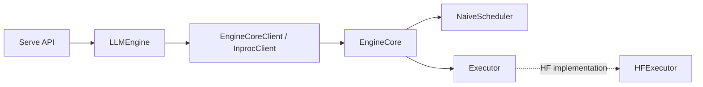
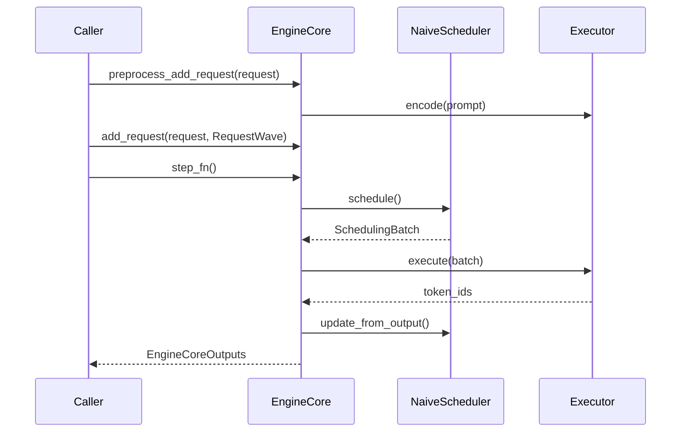

# Design Document

## 1. 背景

此前 Serve 使用 `EngineClient`、`QueuedEngineCoreClient` 和 `MockEngineCore` 组成的异步
transport 链路。这与同步 `EngineCore` 的 `add_request()` / `step_fn()` 接口并存，导致同一个
“engine client” 名称表示两套不兼容的协议。

本阶段以同步 naive `EngineCore` 作为唯一推理路径。`LLMEngine` 表示一个逻辑推理系统，持有
`EngineCoreClient` 并在调用线程推进 Core；`EngineCore` 负责调度和执行。默认 Serve 使用
`InprocClient` 和 `HFExecutor`，不再保留 Mock 或队列 transport。

约束如下：

- 一个 `EngineCore` 绑定一个 `Executor` 和一组可接受的模型别名。
- `EngineCore` 由调用者显式 `step_fn()` 推进；不创建线程、进程或队列。
- `HFExecutor` 每个生成步重算完整上下文，调用 `use_cache=False`；不实现 KV cache、
  prefill/decode 分离、continuous batching 或分布式执行。
- 默认 Serve 在应用生命周期创建时加载 `HFExecutor`；运行它需要安装 `x-tokens[hf]` 并提供可加载
  的 `--hf-model`。`--model` 是 API 对外暴露的模型别名。

## 2. 目标

- 提供与后端无关的 `EngineCore`，负责请求校验、FIFO 调度、状态更新和 Core event 生成。
- 提供 `HFExecutor`，支持 Hugging Face 因果语言模型的编码、左 padding batch forward、
  greedy / temperature / top-p / top-k 采样，以及增量文本解码。
- 保持单步 batch 中每个运行请求至多生成一个 token，且运行请求数不超过 `max_num_seqs`。
- 让输入校验、tokenize 或单次 batch forward 的错误转换为 `CoreErrorEvent`，避免正常请求
  无终止事件。

非目标：实现跨进程隔离、实现异步 output pump 或性能优化。

## 3. 整体设计

当前代码只有一条 in-process 路径：

`EngineCore`、`NaiveScheduler` 位于 `x_tokens/core/`；HF 相关实现位于
`x_tokens/executor/hf.py`。`InprocClient` 是唯一的 `EngineCoreClient` 实现：调用方添加请求后，
通过 `get_output()` 在调用线程执行一次 Core step。`LLMEngine.generate()` 是异步生成器外壳；它
在请求下一个 event 时调用 `get_output()`，分发 batch 中所有请求的 event，并 yield 当前请求的
标准化 `EngineEvent`。

## 4. 详细设计

### 4.1 核心流程

1. 调用方调用 `EngineCore.preprocess_add_request()`：Core 验证模型和采样参数，并调用
   `Executor.encode()`；错误会被保存在 `RequestWave`。
2. 调用方调用 `EngineCore.add_request()`：成功请求加入 scheduler 的 `waiting` 队列；失败请求
   暂存一个 `CoreErrorEvent`。
3. 调用方调用 `step_fn()`：先取出暂存事件，再由 `NaiveScheduler.schedule()` 按 FIFO 将等待
   请求移入 `running`，直至达到 `max_num_seqs`。
4. 对当前所有 running 请求调用一次 `Executor.execute()`。每行上下文为
   `prompt_token_ids + output_token_ids`。
5. scheduler 追加输出 token，并按 EOS、`max_tokens` 或 `max_model_len` 判断结束；Core 输出
   `CoreTokenEvent`（非 EOS token）和/或 `CoreFinishedEvent`。整批 forward 失败时，该 batch
   的所有仍运行请求收到 `CoreErrorEvent`。
6. 调用方可调用 `abort_requests()` 移除 waiting 或 running 请求；`close()` 会中止所有请求。

`step_fn()` 最多执行一次 model forward，因此由调用者决定循环和调度频率。没有 busy loop，
也没有 idle polling 行为。

### 4.2 接口 / 数据结构

| 类型 | 位置 | 当前职责 |
| --- | --- | --- |
| `EngineCoreConfig` | `x_tokens/core/config.py` | `model_aliases`、`max_model_len`、`max_num_seqs` 及模型路由校验。 |
| `ScheduledRequest` | `x_tokens/core/scheduler.py` | 保存原始请求、prompt/output token IDs、已解码文本和状态。 |
| `NaiveScheduler` | `x_tokens/core/scheduler.py` | 维护 `waiting` deque 与 `running` OrderedDict，负责 FIFO 准入、取消和终止状态。 |
| `EngineCore` | `x_tokens/core/engine_core.py` | 协调请求预处理、scheduler 和 executor，并产生 Core events。 |
| `HFExecutorConfig` | `x_tokens/executor/hf.py` | 模型路径、device、dtype 和 `local_files_only`。 |
| `HFExecutor` | `x_tokens/executor/hf.py` | 延迟导入 torch/transformers，加载 HF 模型，执行无 cache 的 batch forward。 |
| `InprocClient` | `x_tokens/engine/clients/inproc.py` | 同步封装 `EngineCore`，暴露 `add_request()`、`get_output()` 和 `abort_requests()`。 |
| `LLMEngine` | `x_tokens/engine/llm_engine.py` | 面向 Serve 的逻辑推理系统；驱动 `EngineCoreClient` step loop 并标准化 events。 |
| `ServeConfig` | `x_tokens/entrypoints/serve/config.py` | API 模型别名和 inproc HF model/device/dtype/batching 配置。 |

`HFExecutor.execute()` 对 batch 采用左 padding，构造 `input_ids` 和 `attention_mask`，并从
`logits[:, -1, :]` 取样。左 padding 保证每一行的最后位置都是实际 token。`decode_delta()`
对完整 completion 解码并与上次文本作前缀差分；若 tokenizer 重写空白导致不再是前缀，则返回
完整新文本。

HF 依赖定义为 optional extra `x-tokens[hf]`。模块只在实际加载模型时导入 `torch` 和
`transformers`。

Serve CLI 的 `--model` 配置请求路由和 API `/v1/models` 中显示的别名；`--hf-model` 配置
`HFExecutor` 读取的本地目录或 Hugging Face model ID。`--hf-device`、`--hf-dtype`、
`--hf-local-files-only` 和 `--hf-max-num-seqs` 分别映射到 executor 与 `EngineCoreConfig`。

### 4.3 接口边界

`EngineCoreClient` 是同步 protocol，定义 `add_request()`、`get_output()`、`abort_requests()`、
`health()` 和 `close()`。`LLMEngine` 是唯一的异步 Serve-facing facade：它的 `generate()` 调用
同步 client，`abort()` / `health()` / `close()` 为了兼容 FastAPI 生命周期而以 async 方法暴露。
没有 `EngineClient`、`QueuedEngineCoreClient`、`MockEngineCore` 或 output stream transport。

## 5. 测试与验证

当前测试覆盖：

- `tests/engine/test_scheduler.py`：FIFO、并发上限、EOS/长度结束和 waiting/running 取消。
- `tests/engine/test_hf_core.py`：使用 `FakeExecutor` 验证 `EngineCore` 的单步 batch、事件顺序和
  请求校验隔离；该测试不加载真实 HF 模型。
- `tests/engine/test_inproc_client.py`：同步 in-process adapter、`LLMEngine` event 标准化，以及
  Core step 在调用线程推进。
- `tests/entrypoints/serve/test_app.py`：Serve 通过注入的 `LLMEngine`-compatible fake 验证 HTTP、
  SSE、取消和 readiness。

验证命令为 `uv run pytest tests/engine tests/entrypoints/serve -q`。测试不加载真实 HF 模型；真实
tokenizer/model、GPU 执行和模型下载仍需要在安装 `x-tokens[hf]` 的环境中单独验证。

## 6. Trade-offs / 已知问题

### 优点

- scheduler 和 executor 依赖边界清晰，调度单元测试不需要 torch 或 transformers。
- 全上下文、无 cache 的执行路径简单，适合作为后续 cache 优化前的语义基线。
- 只保留一套 `LLMEngine` 到 `EngineCore` 的请求与事件语义。

### 缺点 / 限制

- `preprocess_add_request()` 和 `step_fn()` 都在调用线程运行；实际 HF forward 会阻塞该线程。
- 每个 decode step 都重算完整上下文，生成越长计算越慢，不能作为吞吐性能基线。
- 尚无 Stop string、logprobs、beam search、LoRA、prefix cache、chunked prefill 或分布式执行。
- `step_fn()` 会阻塞 FastAPI 所在 event loop，单进程模式不适合生产并发服务。
- 默认 Serve 需要 HF 依赖与可加载模型，不能再作为无模型的 Mock API server 使用。

### Trade-offs

选择同步 Core 是为了让一个请求路径具备明确的所有权：`LLMEngine` 驱动 `EngineCore`，Core 驱动
Executor。代价是模型执行阻塞 event loop，也没有慢消费者隔离。未来若需要进程隔离或异步背压，
应在 `LLMEngine` 和 `EngineCore` 之间新增明确的 transport adapter，而不是重新引入第二套
Serve-facing engine facade。
