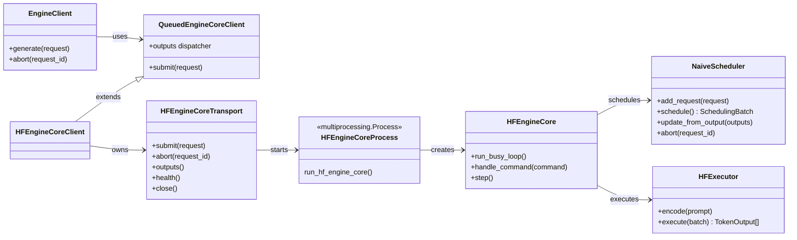
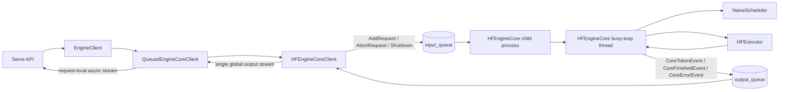
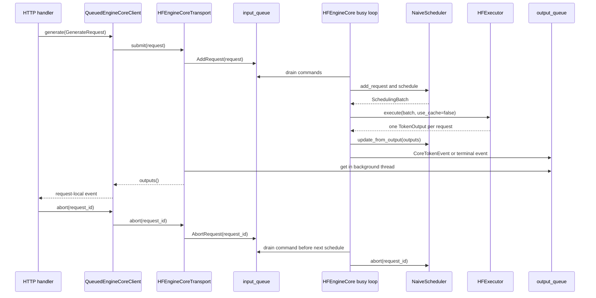

# S2 Naive Hugging Face EngineCore 设计

## 1. 背景

当前 Serve API 已经定义了稳定的推理入口：`EngineClient` 将
`GenerateRequest` 交给 `QueuedEngineCoreClient`，后者从唯一的 Core 输出流中按
`request_id` 分发事件。默认实现 `LocalEngineCoreClient` 仍使用
`MockEngineCore`，只用于验证 HTTP、SSE、取消及慢消费者处理，不能执行真实模型。

S2 的目标是在不改变 Serve API 和 `EngineClientProtocol` 的前提下，提供一个可运行的
Hugging Face（HF）推理 Core，作为后续 KV cache、continuous batching、PD 和多 GPU
执行器的正确性基线。设计借鉴 vLLM V1 将调度和模型执行置于 Engine Core、由 Core
持续调度并将输出回传客户端的职责划分，但有意删除其 KV cache、worker 进程组、数据并行和
结构化输出等能力。[vLLM Engine Core architecture](https://github.com/vllm-project/vllm/blob/main/docs/design/arch_overview.md)

### 1.1 范围与约束

- 一个 `HFEngineCore` 子进程只加载一个 `AutoModelForCausalLM` 和一个
  `AutoTokenizer`，使用单 GPU 或 CPU；请求中的 `model` 必须匹配已加载模型名或配置的
  alias。
- Core 进程与父进程的 `HFEngineCoreTransport` 只经一个 input queue 和一个 output
  queue 通信。父进程仍通过 `QueuedEngineCoreClient` 向 Serve 输出请求私有的异步流。
- Core 内部使用一个专用 busy-loop thread：每轮读取控制消息、调度、执行一次 HF
  forward、发布至多一个 token/request，再进入下一轮。
- 同一个 batch 的序列使用 padding 和 attention mask 进行一次 HF forward；**不使用**
  `past_key_values`，每个 decode step 都重算 prompt 加已生成 token 的完整上下文。
- 初版支持 FIFO 准入、`max_num_seqs` 限制、EOS 和 `max_tokens` 停止；`temperature`、
  `top_p`、`top_k` 映射为逐行采样。stop string、logprobs、beam search、LoRA、prefix
  cache、chunked prefill、PD 和分布式执行不在本期实现范围内。
- 子进程采用 `multiprocessing` 的 `spawn` context，避免 CUDA 初始化后 fork；传给子进程的
  `HFEngineConfig` 必须可 pickle。

### 1.2 预期收益与验收目标

- 以真实 HF forward 替换 Mock，`/v1/completions` 与 `/v1/chat/completions` 可流式返回
  token，并复用 S1 中的取消、SSE 和慢消费者策略。
- 在 `max_num_seqs=N` 时，最多 N 个运行中请求进入同一轮 forward；等待请求按 FIFO
  顺序准入，保证不会饿死。
- 对 greedy 请求（`temperature=0`），同一模型、prompt 和 `max_tokens` 下，xTokens 输出的
  token IDs 与直接逐步调用相同 HF 模型的结果一致。
- 本期以正确性和清晰的演进边界为目标，不设吞吐目标。由于每一步重算全上下文，decode
  复杂度会随生成长度增加，不能作为性能基线。

## 2. 架构

### 2.1 模块职责与边界

`EngineClient`、`QueuedEngineCoreClient` 和 Serve 层的 public protocol 保持不变。新增
`HFEngineCoreClient` 后，Serve 不感知子进程、HF 或调度细节。父进程负责跨进程 transport 与
异步事件桥接；只有子进程持有 `torch`、model 和 tokenizer，避免 API 事件循环被 CUDA
forward 阻塞。

| 模块 | 位置 | 职责 |
| --- | --- | --- |
| `HFEngineCoreClient` | `x_tokens/engine/clients/hf.py` | 组合 `HFEngineCoreTransport` 与现有 `QueuedEngineCoreClient`，暴露现有 `EngineCoreClient` 接口。 |
| `HFEngineCoreTransport` | `x_tokens/engine/clients/hf.py` | 创建、监控和停止 Core 子进程；向 input queue 写命令；用 `asyncio.to_thread()` 从 output queue 读取 `CoreEvent`。 |
| `run_hf_engine_core` | `x_tokens/engine/core.py` | 子进程入口，加载资源、报告 ready/failed，并运行 Core 的 busy-loop thread。 |
| `HFEngineCore` | `x_tokens/engine/core.py` | 处理命令，协调 `NaiveScheduler` 和 `HFExecutor`，将 token、结束及错误事件写入 output queue。 |
| `NaiveScheduler` | `x_tokens/engine/scheduler.py` | 维护 waiting/running 队列、FIFO 准入、取消和一次调度的 batch。它不依赖 torch 或 HF。 |
| `HFExecutor` | `x_tokens/engine/executor/hf.py` | 加载 HF 模型/分词器，准备 padded batch，执行 `use_cache=False` forward，采样和解码 token。 |



### 2.2 进程、队列与消息

每个 `HFEngineCoreTransport` 创建一对有界 `multiprocessing.Queue`。`input_queue` 是多
producer、单消费者队列；`output_queue` 是单 producer、单消费者队列。队列容量由
`HFEngineConfig.input_queue_size` 和 `output_queue_size` 配置，默认值应足以覆盖短暂突发，
但必须有限以限制未处理消息占用的内存。

`QueuedEngineCoreClient` 已经负责将 Core 的全局输出分发到每个请求的有界 `asyncio.Queue`。
因此，Core 不需要了解 HTTP/SSE consumer；某个 client 的私有输出队列满时，现有 dispatcher
会取消该请求，随后向 input queue 发送 `AbortRequest`。父进程必须持续 drain `output_queue`，
不允许由 HTTP handler 直接读取它。



新增消息均为 frozen、slots dataclass，且只包含可 pickle 的标量、tuple 或已存在的
`GenerateRequest`：

| 方向 | 消息 | 字段 / 语义 |
| --- | --- | --- |
| parent → Core | `AddRequest` | `request: GenerateRequest`。相同 `request_id` 由 client 拒绝；Core 再次检测以保证进程边界正确性。 |
| parent → Core | `AbortRequest` | `request_id`。等待中直接移除；运行中在下一个调度点移除，不再发布 token。 |
| parent → Core | `Shutdown` | 请求 Core 停止接收新工作，终止所有存活请求并退出。 |
| Core → parent | `CoreTokenEvent` | 已采样的 `request_id`、`token_id` 和增量 `text`。 |
| Core → parent | `CoreFinishedEvent` | EOS 或长度结束后的 `finish_reason`、prompt/completion token 数。 |
| Core → parent | `CoreErrorEvent` | 单请求校验、tokenize、forward 或采样失败。失败不影响同 batch 其他请求。 |

ready 状态不走请求输出流：transport 使用一个 `multiprocessing.Event` 和只写一次的
startup-error 状态。应用 lifespan 等待该 event 或子进程提前退出；`health()` 同时检查 event、
进程存活和启动错误。Core 初始化失败时，factory 使 readiness 为 false，不接受生成请求。

### 2.3 调度与执行数据结构

`NaiveScheduler` 维护 `waiting: deque[ScheduledRequest]` 与
`running: OrderedDict[str, ScheduledRequest]`。`ScheduledRequest` 包含原始
`GenerateRequest`、`prompt_token_ids`、`output_token_ids`、`prompt_tokens`、状态和取消标记；
它只存 Python token IDs，不存 GPU tensor 或 KV cache。

`SchedulingBatch` 为本轮所有 running request 的快照，每行是：

```text
context_token_ids = prompt_token_ids + output_token_ids
```

每轮调度规则如下：

1. drain 所有当前可获得的 `AddRequest`、`AbortRequest` 和 `Shutdown` 命令；先处理取消。
2. 从 `waiting` 队首按 FIFO 移动请求，直到 `running` 达到 `max_num_seqs`。模型名不匹配、空
   prompt、超过 `max_model_len` 的 prompt 或无效采样参数在准入前输出 `CoreErrorEvent`。
3. `schedule()` 返回所有 running request（每个请求每轮至多一行）。请求没有 KV cache，因此
   不区分 prefill 与 decode，也不做 token budget 或抢占。
4. `HFExecutor.execute()` 以左 padding 的 `input_ids`、`attention_mask` 调用
   `AutoModelForCausalLM(..., use_cache=False)`；从每行最后一个非 padding 位置的 logits 按该
   请求的 `SamplingParams` 采样一个 token ID。
5. `update_from_output()` 把 token 追加到对应 `output_token_ids`。若为 EOS 则输出
   `FinishReason.STOP`；若达到 `max_tokens` 则输出 `FinishReason.LENGTH`；否则输出
   `CoreTokenEvent` 并留在 running。完成或失败的请求被移除，下轮可接纳 waiting 请求。

`HFExecutor` 使用 `torch.inference_mode()`，将 inputs 放到模型输入设备。它以 tokenizer 对完整
completion token 序列解码，并仅将相对上一次文本新增的后缀作为 `CoreTokenEvent.text`；这样
避免 BPE/SentencePiece 单 token 解码造成不自然的空格。若新增文本暂时为空，仍发布 token event
（`text=""`），以保证每个已采样 token 都可被统计。

### 2.4 busy loop 与生命周期

Core 子进程主线程创建并启动一个非 daemon 的 `HFEngineCore.run_busy_loop` thread，然后等待它
结束。该 thread 是 Core 状态的唯一写者，因此 scheduler 不加锁，model forward 也不会与另一个
forward 并发。父进程的 queue pump 与 HTTP 事件循环从不直接访问 Core 内存。



当 `waiting` 与 `running` 都为空时，busy-loop thread 以短 timeout 阻塞在 `input_queue.get()`；
收到首个命令后恢复连续调度。这样保留运行时“持续 schedule → forward → emit”的 busy-loop
语义，同时避免空闲时占满一个 CPU 核。只要存在 running 请求，loop 不等待 queue，保证每轮都推进
一个 token。

异常边界如下：

- 单请求的输入验证、编码、采样或解码异常产生该请求的 `CoreErrorEvent`，并从 scheduler 移除；
  同 batch 其他行继续完成。
- 一次批量 `model.forward` 异常无法可靠定位到单行，Core 对 batch 中所有请求输出不可重试的
  `CoreErrorEvent`，清空 running，然后继续处理新的 waiting 请求。连续的 Core 级异常应记录日志，
  但本期不自动重启模型。
- input/output queue 损坏、未捕获异常或 Core 子进程退出会使 transport 结束其输出流；现有
  `QueuedEngineCoreClient` 将所有尚未完成的请求转为 error event。`health()` 随后返回 not ready。
- `Shutdown` 后 Core 依次为 waiting/running 请求发布终止错误，停止 busy loop，并由 parent
  `join(timeout)`；超时后才 `terminate()`，避免正常关闭时遗失事件。

### 2.5 配置与依赖

`HFEngineConfig` 位于 `x_tokens/engine/config.py`，至少包含：

| 字段 | 说明 |
| --- | --- |
| `model` | Hugging Face model ID 或本地目录。 |
| `model_aliases` | 可接受的 `GenerateRequest.model` 名称。 |
| `device` / `dtype` | 传给 HF/torch 的执行设备和精度。 |
| `max_model_len` | prompt 加生成 token 的硬上限。 |
| `max_num_seqs` | 一个 forward batch 的最大请求数。 |
| `input_queue_size` / `output_queue_size` | 跨进程队列容量。 |
| `idle_poll_timeout_s` / `shutdown_timeout_s` | 空闲轮询与优雅退出超时。 |

实现时将 `transformers` 与 `torch` 声明为 `hf` optional dependency，例如
`x-tokens[hf]`；CUDA 对应的 torch wheel 由部署环境按 GPU/CUDA 版本安装。不得在 import
`x_tokens` 或启动纯 Mock Serve 时导入 transformers，以维持 S1 的无 GPU 测试能力。

## 3. 测试/使用

### 3.1 使用方式

安装 HF 后端依赖并以一个小型因果语言模型启动服务：

```bash
uv pip install --python .venv/bin/python -e '.[hf]'
python -m x_tokens serve \
  --engine hf \
  --model <hf-model-id-or-local-path> \
  --max-num-seqs 4 \
  --max-model-len 2048
```

CLI 实现应将 `--engine hf` 映射为 `EngineClient(HFEngineCoreClient(config))`，应用 startup
等待 Core ready，shutdown 调用 `EngineClient.close()`。以下请求应收到逐 token 的 SSE 事件与最终
usage：

```bash
curl -N http://127.0.0.1:8000/v1/completions \
  -H 'content-type: application/json' \
  -d '{"model":"<model-alias>","prompt":"The capital of France is","max_tokens":8,"temperature":0,"stream":true}'
```

### 3.2 测试策略

新增测试位于 `tests/engine/`，HF 测试使用本地构造的极小模型和 tokenizer fixture，禁止依赖
Hub 下载或 GPU。测试必须明确关闭 client/子进程，防止 pytest 残留 worker。

| 层级 | 覆盖内容 | 验收条件 |
| --- | --- | --- |
| `test_scheduler.py` | FIFO、`max_num_seqs`、取消 waiting/running、EOS/length 状态转移 | 每轮 batch 不超过上限；取消请求以后不再被调度；等待请求最终可获得 slot。 |
| `test_hf_executor.py` | padding/attention mask、greedy 采样、temperature/top-p/top-k、解码增量 | batched greedy token IDs 与对每条序列单独的 HF forward 一致。 |
| `test_hf_core.py` | input/output 消息、连续多轮生成、批量 forward 异常、模型/输入校验 | 每个正常请求恰有一个 terminal event；一个请求的错误不污染其他请求。 |
| `test_hf_client.py` | 子进程启动、ready/health、输出 pump、abort、close | client 可多请求并发消费；abort 后输出流结束且进程可在 timeout 内退出。 |
| Serve 集成测试 | `--engine hf` 的 completion 与 chat 流 | 响应为合法 SSE；`[DONE]` 后有正确 usage；S1 回归测试继续通过。 |

### 3.3 手工 benchmark 与已知限制

使用已有 `test_serve` 对同一小模型运行单请求和 `max_num_seqs > 1` 两组 workload，记录 TTFT、
TPOT、端到端 latency、成功率以及 Core 进程峰值显存。验收重点是输出可用、请求不会互相阻塞、取消
生效和无子进程泄漏；不以吞吐优于 vLLM 或带 KV cache 的引擎作为目标。

该方案的主要取舍是以重复计算换取最小实现：它已经具有以后加入 continuous batching 所需的
全局请求队列、每轮调度和批量执行边界，却不会尝试模拟 KV block 管理或 prefill/decode 分离。
下一阶段可在不改变 client/queue 协议的情况下，将 `ScheduledRequest` 扩展为持有 KV cache 状态，
并让 `HFExecutor` 的输入改为 prefill/decode 元数据。
