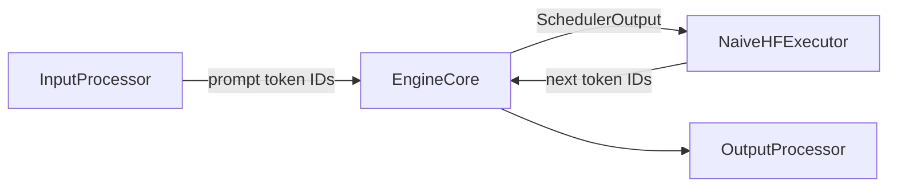
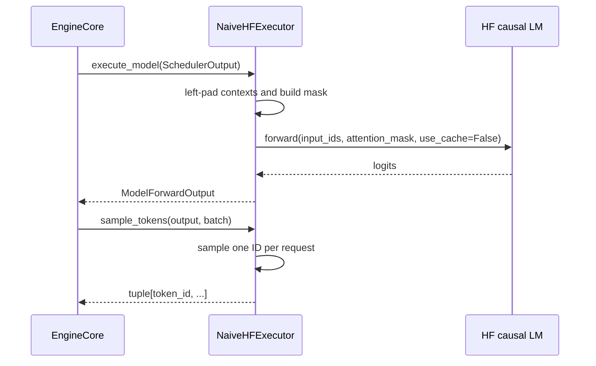

# 实现基于 Hugging Face 的朴素无 KV Cache 执行器

## 1. 背景

`EngineCore` 只定义调度和 `Executor` contract，不能承载 Hugging Face 模型加载或 forward 细节。`NaiveHFExecutor` 是当前该 contract 的实现：它接收 scheduler 给出的 token-ID 上下文，执行一次 Hugging Face causal LM 前向，再根据请求参数采样每个请求的下一个 token ID。

该实现用于建立正确性基线；每个生成 step 都重算完整上下文且 `use_cache=False`，不应作为性能优化后的推理路径。

## 2. 目标

- 实现 `Executor.execute_model(SchedulerOutput) -> ModelForwardOutput` 和 `Executor.sample_tokens(ModelForwardOutput, SchedulerOutput) -> tuple[int, ...]`。
- 加载 Hugging Face causal LM，按 batch 左 padding 构造 `input_ids` 与 `attention_mask`。
- 支持 greedy (`temperature=0`)、temperature、top-k 与 top-p 采样。
- 向 Core 暴露 `eos_token_ids`，供 Core 决定完成状态。

不包含 request admission、调度、tokenization、chat template、token-ID 输入校验、增量 detokenization 或 SSE。

## 3. 整体设计



`TokenizerInputProcessor` 提供 `pad_token_id` 和 `eos_token_ids` 给 executor 配置，但 tokenizer 本身不属于 `NaiveHFExecutor`。`OutputProcessor` 在 Engine 层使用 tokenizer 将 Core token IDs 解码为文本。

## 4. 详细设计

### 4.1 核心流程

1. 应用启动时创建 `TokenizerInputProcessor`，读取 tokenizer 的 padding/EOS 元数据。
2. 应用用这些元数据创建 `NaiveHFExecutorConfig` 并构造 `NaiveHFExecutor`；executor 延迟导入 torch/transformers 并加载 causal LM。
3. Core 调用 `execute_model(batch)`。executor 为每个 `ScheduledRequest` 读取 `prompt_token_ids + output_token_ids`。
4. executor 左填充到本 batch 最大长度，构造 attention mask，以 `use_cache=False` 调用模型。
5. 从每一行 `logits[:, -1, :]` 构造 `ModelForwardOutput` 返回给 Core。
6. Core 调用 `sample_tokens(output, batch)`，按请求的 `SamplingParams` 采样一个 token ID。



### 4.2 接口 / 数据结构

```python
@dataclass(frozen=True, slots=True)
class NaiveHFExecutorConfig:
    model: str
    device: str = "auto"
    dtype: str = "auto"
    local_files_only: bool = False
    pad_token_id: int | None = None
    eos_token_ids: frozenset[int] = frozenset()

class NaiveHFExecutor(Executor):
    @property
    def eos_token_ids(self) -> frozenset[int]: ...
    def execute_model(self, batch: SchedulerOutput) -> ModelForwardOutput: ...
    def sample_tokens(
        self, output: ModelForwardOutput, batch: SchedulerOutput
    ) -> tuple[int, ...]: ...

`execute_model` 只负责输入构造和模型 forward，不执行采样；`sample_tokens`
消费同一 batch 顺序的 `ModelForwardOutput.logits`。这样 Core 可以独立处理
forward/采样异常，scheduler 仍负责 EOS 和长度终止判断。
```

`pad_token_id` 必须由 Engine 的 input processor 提供；缺失时构造 executor 失败。`device="auto"` 使用 HF `device_map="auto"`，非 CPU 的显式 device 则在加载后调用 `model.to(device)`。

### 4.3 采样规则

| 条件 | 行为 |
| --- | --- |
| `temperature == 0` | 对 logits 执行 `argmax`。 |
| `temperature > 0` | logits 除以 temperature。 |
| `top_k` 非空 | 低于第 k 个 logit 的候选置为 `-inf`。 |
| `top_p < 1` | 按概率累计质量过滤候选。 |
| 其他情况 | softmax 后使用 multinomial 采样。 |

## 5. 测试与验证

当前 Core 测试使用 `FakeExecutor` 覆盖 executor contract，不下载模型：

- `tests/engine/test_hf_core.py`
- `tests/engine/test_inproc_client.py`

真实模型手工验证需要可访问的 HF 模型：

```bash
python -m x_tokens --model <served-model-name> --hf-model <hf-model> --port 8000
```

随后向 `/v1/completions` 发起请求，确认 token 输出、EOS/长度终止和采样参数生效。

## 6. Trade-offs / 已知问题

### 优点

- executor 不依赖 tokenizer、Serve 或 scheduler 实现，可由 `EngineCore` 直接替换。
- 左 padding 保证每一行的最后 logit 对应真实上下文的最后 token。

### 缺点 / 限制

- 每 step 重算完整上下文，`use_cache=False`，生成长度增加时计算成本显著上升。
- 不支持 KV cache、prefill/decode 分离、量化、CUDA graph、分布式执行或模型热切换。
- executor forward 仍由当前同步 in-process `EngineCore` 调用，可能阻塞服务事件循环。

### Trade-offs

选择朴素 HF executor 是为了以较小的代码量验证 token-ID Core contract 和采样语义。性能路径可新增 KV-cache executor 并保持相同 `Executor` protocol，而无需将 HF 细节重新放入 `EngineCore`。
