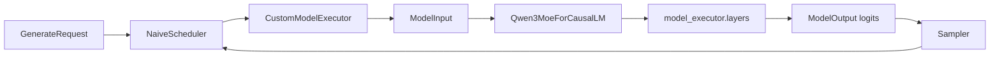
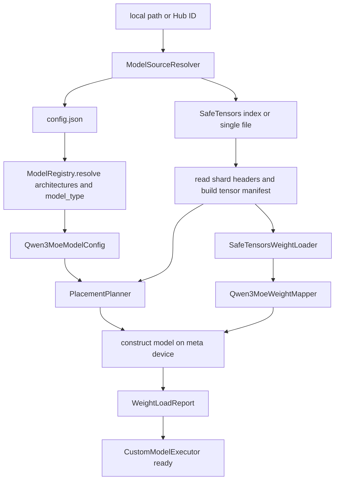
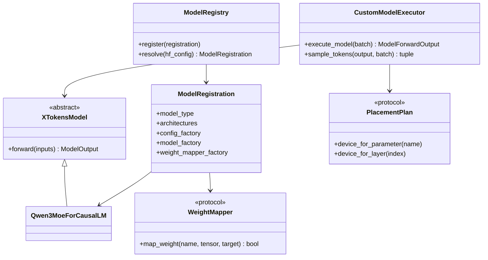
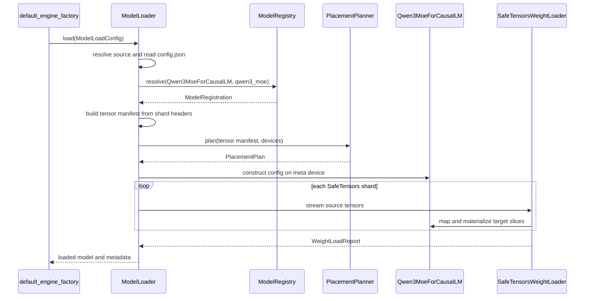
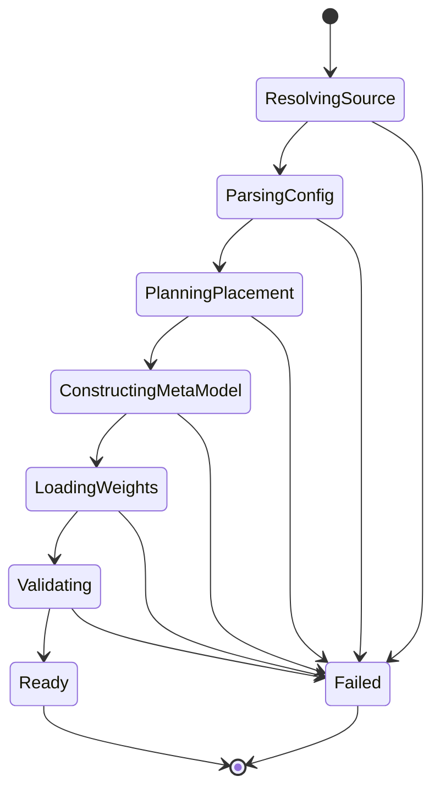

# 设计文档

## 摘要

xTokens 新增独立的 `model_executor` 模型架构层，在不依赖 Hugging Face `AutoModelForCausalLM` 执行 forward 的前提下，继续兼容 Hugging Face 的模型目录、`config.json`、tokenizer 和 SafeTensors 权重。系统优先通过 HF config 的 `architectures` 选择具体模型实现，以 `model_type` 校验配置族并在映射唯一时提供回退；流式、严格校验的权重加载器将 HF checkpoint 映射到 xTokens 参数布局，再由新的 `CustomModelExecutor` 接入现有 `Executor` contract。第一阶段只支持本机目标模型 Qwen3-30B-A3B（`Qwen3MoeForCausalLM`、`model_type=qwen3_moe`），保持无 KV cache 的完整上下文 forward，使用 PyTorch SDPA 和正确性优先的 MoE 实现，并支持两卡 contiguous layer placement；现有 `NaiveHFExecutor` 继续作为默认实现和正确性回退。后续在稳定 contract 上逐步加入 fused kernel、KV cache、Tensor Parallel 和 Expert Parallel。本设计已核对本机 `/model` 的 config、16 个 shard 和 18,867 个 tensor key，代码实现尚未开始。

## 背景

当前 xTokens 的模型执行完全由 `NaiveHFExecutor` 调用 Hugging Face：

```text
model path / Hub ID
    ↓
AutoModelForCausalLM.from_pretrained()
    ↓
Hugging Face model.forward()
    ↓
ModelForwardOutput.logits
```

该路径适合建立功能基线，但模型结构、attention backend、MoE token dispatch、权重布局和 forward 中间张量都由 Transformers 控制。xTokens 无法针对目标硬件替换单个 layer、融合 QKV/SwiGLU、控制 logits materialization、设计 KV cache 接口或实现 Expert Parallel。

仓库当前主要目标模型是本地 `/model` 中的 Qwen3-30B-A3B：

- `config.json` 的 `model_type` 为 `qwen3_moe`，`architectures` 为 `Qwen3MoeForCausalLM`。
- 48 层、hidden size 2048、32 个 Q head、4 个 KV head、显式 `head_dim=128`。
- 每层 128 个专家，每 token 选择 8 个专家，MoE intermediate size 为 768。
- checkpoint 由 16 个 SafeTensors shard 组成，共 18,867 个 tensor key。
- HF checkpoint 为逐专家权重：`experts.<id>.gate_proj/up_proj/down_proj.weight`。
- bf16 权重约 61 GB，需要至少两张 48 GB GPU；当前 HF 路径使用 `device_map="auto"`。

因此，第一版 custom model 既要建立可优化的内部模型结构，也必须能在两卡机器上加载真实 checkpoint，不能只实现一个无法承载目标模型的单卡 toy path。

四个概念需要严格区分：

| 名称 | 示例 | 职责 |
|---|---|---|
| `ModelConfig.model` | `/model` 或 `Qwen/Qwen3-30B-A3B` | checkpoint 来源 |
| `ModelConfig.served_model_name` | `qwen3-30b-a3b` | OpenAI API 展示和路由别名 |
| HF `config.architectures` | `Qwen3MoeForCausalLM` | 选择具体任务模型实现 |
| HF `config.model_type` | `qwen3_moe` | 选择 config adapter，并校验模型族 |

模型注册不得使用 `served_model_name`，也不能根据目录名猜测架构。

## 目标

- 建立 xTokens 自有的 model architecture 层，不依赖 HF model class 执行 forward。
- 同时支持本地 HF 模型目录和 Hugging Face Hub model ID。
- 读取标准 HF `config.json`，转换为经过严格校验的内部 model config。
- 通过显式 registry 将 `architectures` 和 `model_type` 映射到 model/config/weight mapper。
- 流式加载单文件或分片 SafeTensors，避免构造完整 CPU `state_dict`。
- 严格检查 missing、unexpected、duplicate、shape 和 dtype 错误。
- 支持 HF checkpoint 名称到 xTokens 参数布局的一对一、切片和融合映射。
- 第一版实现 Qwen3-30B-A3B 的 embedding、RMSNorm、GQA、Q/K norm、RoPE、MoE 和 LM head。
- 第一版保持 no-KV-cache 语义，与 `NaiveHFExecutor` 进行 logits/token parity 验证。
- 第一版支持两卡 contiguous layer placement，使真实 61 GB bf16 checkpoint 可以加载和执行。
- 保留现有 `Executor`、Scheduler、Engine 和 OpenAI API 边界。
- 为 attention、MoE、linear、quantization 和 placement 预留可替换实现点。

## 非目标

第一阶段不包含：

- KV cache、paged attention、prefix cache 或 chunked prefill。
- Tensor Parallel、Expert Parallel、Pipeline Parallel runtime 或多进程 collective。
- CUDA Graph、FlashAttention 自定义 kernel、fused MoE kernel 或量化。
- 训练、反向传播、router auxiliary loss 或 HF `GenerationMixin`。
- 任意 HF architecture 自动运行；未注册的 `model_type` 必须快速失败。
- `trust_remote_code=True` 或执行 checkpoint 仓库中的任意 Python 代码。
- GGUF、PyTorch pickle `.bin`、GPTQ、AWQ 或其他非 SafeTensors 格式。
- 替换 tokenizer/chat template；第一阶段继续使用 `AutoTokenizer`。
- 在模型层处理 sampling、请求状态、SchedulerOutput 或 HTTP 对象。

上述能力应在 correctness baseline 完成后分别设计，不能在第一版中通过不稳定的占位接口假装支持。

## 设计概述

### 目录结构

建议目录结构：

```text
x_tokens/
├── model_executor/
│   ├── __init__.py
│   ├── config.py                 # 内部 ModelArchitectureConfig
│   ├── interfaces.py             # ModelInput/ModelOutput/XTokensModel
│   ├── registry.py               # ModelRegistry/ModelRegistration
│   ├── placement.py              # PlacementPlan 和两卡 layer placement
│   ├── loader/
│   │   ├── __init__.py
│   │   ├── source.py             # local/Hub source resolution
│   │   ├── config_loader.py      # HF config -> internal config
│   │   ├── safetensors_loader.py # shard streaming 和 load report
│   │   └── weight_mapper.py      # 名称、切片和融合映射规则
│   ├── layers/
│   │   ├── attention.py          # backend-neutral GQA wrapper
│   │   ├── attention_backend.py  # TorchSDPABackend，后续 kernel backend
│   │   ├── linear.py             # linear/fused projection primitives
│   │   ├── moe.py                # router、expert dispatch、SwiGLU
│   │   ├── normalization.py      # RMSNorm
│   │   └── rotary_embedding.py   # RoPE
│   └── models/
│       ├── __init__.py           # 显式注册内置模型
│       └── qwen3_moe.py          # Qwen3-MoE model-specific 组合
└── executor/
    ├── base.py
    ├── sampler.py                # 从 NaiveHFExecutor 抽出的共享 sampler
    ├── naive_hf_executor.py
    └── custom_model_executor.py  # Engine Executor adapter
```

`model_executor` 负责 tensor、module、config、placement 和 checkpoint；`executor` 负责把
`SchedulerOutput` 转换成 model input，并将 logits 交给 sampler。模型实现不得 import
`x_tokens.core.scheduler`。

`TransformerLayer` 不作为通用 building block。RMSNorm、RoPE、attention backend、linear 和 MoE
适合复用；residual 顺序、norm 位置、Q/K norm 和 dense/MoE 选择属于具体 architecture，应保留在
`models/qwen3_moe.py`。

### 运行时数据流



### 加载数据流



## 详细设计

### 核心流程

模型加载分为九步：

1. `ModelSourceResolver` 接收 `ModelLoadConfig.model`。本地目录直接解析；Hub ID 使用
   `huggingface_hub.snapshot_download()` 获取 config、tokenizer、SafeTensors index 和 shards，并遵守
   `revision`、`cache_dir`、`local_files_only`。
2. `ConfigLoader` 读取 `config.json` 为普通 mapping，不加载 remote Python code。
3. `ModelRegistry.resolve()` 按 `architectures` 的声明顺序选择第一个已注册实现，并校验该 registration 的 `model_type`。只有 `architectures` 缺失或没有已注册候选、且 `model_type` 恰好对应一个 CausalLM registration 时才允许回退；否则给出候选和已支持列表后失败。
4. 对应的 config adapter 将 HF mapping 转为内部不可变 config，并验证维度、head、expert 和 RoPE 约束。
5. loader 读取 SafeTensors shard header，建立包含 tensor name、shape、dtype 和 shard 的 manifest；index JSON 只负责 tensor 到 shard 的映射。`PlacementPlanner` 根据 manifest 估算参数 bytes，为每个 module/parameter 生成目标 device。
6. model class 在 `meta` device 上构造，避免先在 CPU 初始化一份完整随机权重。
7. `SafeTensorsWeightLoader` 按 shard 流式读取 tensor，`WeightMapper` 将 HF key 写入内部 parameter 或 parameter slice，然后释放 shard/tensor 引用。
8. loader 验证所有必需 parameter 恰好加载一次，并生成逐 device bytes、missing、unexpected、duplicate、shape mismatch 报告；strict 模式下任一错误都终止启动。
9. `CustomModelExecutor` 保存已加载 model、input device、sampler 和 EOS metadata，向 `EngineCore` 提供现有 `Executor` 接口。

模型 forward 仍采用当前 no-KV-cache 基线：executor 对每个请求读取完整
`prompt_token_ids + output_token_ids`，左 padding 后形成 `[batch, sequence]` 的 `input_ids`、
`attention_mask` 和 `position_ids`。model 只为每个序列最后一个有效位置计算 LM head logits，返回
`[batch, vocab_size]`，不得物化 `[batch, sequence, vocab_size]` 的完整 logits。

### 接口与数据结构

#### 模型来源与加载配置

```python
@dataclass(frozen=True, slots=True)
class ModelLoadConfig:
    model: str
    revision: str | None = None
    cache_dir: str | None = None
    local_files_only: bool = False
    dtype: str = "auto"
    devices: tuple[str, ...] = ("cuda:0",)
    placement: str = "balanced_layers"
    strict_weights: bool = True
```

`model` 是本地目录或 Hub ID，不是 served model alias。`dtype="auto"` 使用 checkpoint/config dtype；
显式转换只允许受支持的 floating dtype，不能静默把量化或整数权重转换为浮点。

#### 内部架构配置

内部 config 不直接把 Transformers config 对象传入 layer：

```python
@dataclass(frozen=True, slots=True)
class Qwen3MoeModelConfig:
    model_type: str
    vocab_size: int
    hidden_size: int
    num_hidden_layers: int
    num_attention_heads: int
    num_key_value_heads: int
    head_dim: int
    rms_norm_eps: float
    rope_theta: float
    max_position_embeddings: int
    num_experts: int
    num_experts_per_tok: int
    moe_intermediate_size: int
    decoder_sparse_step: int
    mlp_only_layers: tuple[int, ...]
    intermediate_size: int
    norm_topk_prob: bool
    tie_word_embeddings: bool
```

转换时至少验证：

- `model_type == "qwen3_moe"`。
- `num_attention_heads % num_key_value_heads == 0`。
- `head_dim` 使用 config 显式值；不能用 `hidden_size // num_attention_heads` 覆盖。
- Q/K projection 输出分别为 `num_*_heads * head_dim`。
- `num_experts_per_tok <= num_experts`。
- `moe_intermediate_size > 0`，sparse/dense layer 选择字段合法。
- `max_position_embeddings > 0`，只接受已实现的 RoPE scaling 类型。

未知 HF 字段可以保存在只读 `extra_config` 中用于诊断，但 layer 不得依赖未声明字段。

#### 模型注册表

```python
@dataclass(frozen=True, slots=True)
class ModelRegistration:
    model_type: str
    architectures: tuple[str, ...]
    config_factory: ConfigFactory
    model_factory: ModelFactory
    weight_mapper_factory: WeightMapperFactory

class ModelRegistry:
    def register(self, registration: ModelRegistration) -> None: ...
    def resolve(
        self, hf_config: Mapping[str, object]
    ) -> ModelRegistration: ...
```

内置模型在 `model_executor/models/__init__.py` 显式注册。禁止依赖 decorator import 顺序或扫描文件系统；
重复 architecture 名称直接报错，同一 `model_type` 可以注册不同任务 head，但此时禁止按 `model_type`
回退。第一版 registry 仅包含：

```text
Qwen3MoeForCausalLM (model_type=qwen3_moe)
```

如果已匹配的 architecture 与 config 的 `model_type` 不一致，给出明确错误，不能默默选择其他类。

#### 模型前向接口

```python
@dataclass(frozen=True, slots=True)
class ModelInput:
    input_ids: torch.Tensor       # [batch, sequence]
    attention_mask: torch.Tensor  # [batch, sequence]
    position_ids: torch.Tensor    # [batch, sequence]

@dataclass(frozen=True, slots=True)
class ModelOutput:
    logits: torch.Tensor          # [batch, vocab_size]

class XTokensModel(nn.Module, ABC):
    @abstractmethod
    def forward(self, inputs: ModelInput) -> ModelOutput: ...
```

contract 不接受 `ScheduledRequest`、`SchedulerOutput` 或 sampling 参数。KV cache 后续通过新的设计扩展
`ModelInput`/attention metadata，不在第一版塞入 `Any` 类型占位对象。

#### 权重加载器

```python
@dataclass(frozen=True, slots=True)
class WeightLoadReport:
    loaded_source_tensors: int
    loaded_parameters: int
    parameter_bytes_by_device: dict[str, int]
    missing_parameters: tuple[str, ...]
    unexpected_tensors: tuple[str, ...]
    duplicate_parameters: tuple[str, ...]
    shape_mismatches: tuple[str, ...]

class WeightMapper(Protocol):
    def map_weight(
        self,
        source_name: str,
        source_tensor: torch.Tensor,
        target: XTokensModel,
    ) -> bool: ...
```

`bool` 表示 source tensor 是否被消费；真实实现内部使用预编译的 exact/regex mapping rule，不在每个
tensor 上遍历整个 parameter tree。loader 必须在写入前检查目标 shape、slice shape 和 dtype，并维护
parameter/slice 的加载位图。

对于 `gate_up_proj` 这类由多个 source slice 组成的 fused parameter，loader 在第一个 slice 到达时按
placement plan 在目标 device 分配完整 parameter，并将每个 slice 的完成状态单独记入位图。只有全部
必需 slice 加载完成后 parameter 才可被标记为 ready；缺片、重复写入或交叠写入均属于 strict load error。

#### 设备放置

```python
class PlacementPlan(Protocol):
    def device_for_parameter(self, parameter_name: str) -> torch.device: ...
    def device_for_layer(self, layer_index: int) -> torch.device: ...
```

第一版 `BalancedLayerPlacement` 根据 tensor manifest 估算 layer bytes，将连续 decoder layers 分配到
`devices`。Embedding 放在第一张卡，final norm 和 LM head 放在最后一张卡；模型 forward 只在 device
边界移动 hidden states。该方案是单进程 model parallel，不是 Tensor Parallel，也不会让两张 GPU 同时
计算同一个 layer，但可以加载并验证真实 61 GB checkpoint。

placement 必须是确定性的；相同 config、tensor manifest 和 device capacity 应生成相同 plan。启动日志
记录每张卡的 layer range 和 parameter bytes。若任一卡容量不足，加载前失败，不能依赖 CUDA OOM 作为容量
检查。

### Qwen3-MoE 模型架构

模型组合关系：

```text
Qwen3MoeForCausalLM
├── Qwen3MoeModel
│   ├── Embedding
│   ├── 48 × Qwen3MoeDecoderLayer
│   │   ├── RMSNorm
│   │   ├── Qwen3MoeAttention
│   │   │   ├── q_proj + q_norm
│   │   │   ├── k_proj + k_norm
│   │   │   ├── v_proj
│   │   │   ├── RotaryEmbedding
│   │   │   ├── AttentionBackend
│   │   │   └── o_proj
│   │   ├── RMSNorm
│   │   └── Qwen3MoeSparseMoeBlock 或 DenseSwiGLU
│   │       ├── TopKRouter（sparse layer）
│   │       └── Experts(SwiGLU, sparse layer)
│   └── final RMSNorm
└── lm_head
```

Attention 必须遵守以下细节：

- `head_dim` 从 config 读取。本地目标模型为 128，不能按 `2048 / 32` 得到错误的 64。
- Q/K 在 reshape 为逐头张量后执行 head-dim RMSNorm。
- RoPE 只作用于 Q/K，使用 config 的 `rope_theta` 和 position IDs。
- GQA 将 4 个 KV heads 映射到 32 个 Q heads。
- 第一版 backend 为 `TorchSDPABackend`；padding 和 causal mask 的组合必须与 HF baseline 一致。
- attention 输出 reshape 为 `num_attention_heads * head_dim` 后经过 `o_proj` 返回 hidden size。

MoE 必须遵守以下细节：

- router logits 以 fp32 执行 softmax，再取 top-k。
- `norm_topk_prob=true` 时对选中专家权重重新归一化。
- token 按 expert 分组，执行 `SiLU(gate_proj(x)) * up_proj(x)`，再执行 `down_proj`。
- expert 结果乘 routing weight 后累加回原 token 顺序。
- 推理不计算或返回 router auxiliary loss。
- 第一版 correctness backend 可以按 expert 循环；接口必须允许后续替换为 fused/grouped GEMM backend。

为减少 kernel launch 和便于后续 fused MoE，内部 expert 参数采用：

```text
gate_up_proj: [num_experts, 2 * moe_intermediate_size, hidden_size]
down_proj:    [num_experts, hidden_size, moe_intermediate_size]
```

### HF 权重映射

Qwen3-MoE 第一版保留 attention projection 的独立参数，只融合 expert gate/up。关键映射如下：

| HF source key | xTokens target |
|---|---|
| `model.embed_tokens.weight` | `model.embed_tokens.weight` |
| `model.layers.L.self_attn.q_proj.weight` | `model.layers.L.self_attn.q_proj.weight` |
| `model.layers.L.self_attn.k_proj.weight` | `model.layers.L.self_attn.k_proj.weight` |
| `model.layers.L.self_attn.v_proj.weight` | `model.layers.L.self_attn.v_proj.weight` |
| `model.layers.L.self_attn.o_proj.weight` | `model.layers.L.self_attn.o_proj.weight` |
| `model.layers.L.self_attn.q_norm.weight` | `model.layers.L.self_attn.q_norm.weight` |
| `model.layers.L.self_attn.k_norm.weight` | `model.layers.L.self_attn.k_norm.weight` |
| `model.layers.L.mlp.gate.weight` | `model.layers.L.mlp.router.weight` |
| `model.layers.L.mlp.experts.E.gate_proj.weight` | `experts.gate_up_proj[E, :I, :]` |
| `model.layers.L.mlp.experts.E.up_proj.weight` | `experts.gate_up_proj[E, I:, :]` |
| `model.layers.L.mlp.experts.E.down_proj.weight` | `experts.down_proj[E, :, :]` |
| `model.layers.L.mlp.gate_proj.weight` | `model.layers.L.mlp.gate_proj.weight`（dense layer） |
| `model.layers.L.mlp.up_proj.weight` | `model.layers.L.mlp.up_proj.weight`（dense layer） |
| `model.layers.L.mlp.down_proj.weight` | `model.layers.L.mlp.down_proj.weight`（dense layer） |
| `model.layers.L.input_layernorm.weight` | 同名参数 |
| `model.layers.L.post_attention_layernorm.weight` | 同名参数 |
| `model.norm.weight` | `model.norm.weight` |
| `lm_head.weight` | `lm_head.weight` |

其中 `I=moe_intermediate_size`。mapper 不得假设 shard 顺序或词典顺序；同一 fused target 的两个 slice
可以来自不同 shard。load report 需要分别跟踪每个 expert 的 gate/up/down slice 是否齐全。

`tie_word_embeddings=true` 时由 architecture registration 明确声明 alias 策略；Qwen3-30B-A3B 为 false，
embedding 和 LM head 必须分别加载。

### 类图、时序图与状态图





loader 状态必须单向推进，失败后 model 不可进入 executor：



### 与 Executor 和服务层集成

新增 `CustomModelExecutor` 实现现有 contract：

```python
class Executor(Protocol):
    @property
    def eos_token_ids(self) -> frozenset[int]: ...
    def execute_model(self, batch: SchedulerOutput) -> ModelForwardOutput: ...
    def sample_tokens(
        self,
        output: ModelForwardOutput,
        batch: SchedulerOutput,
    ) -> tuple[int, ...]: ...
```

`CustomModelExecutor.execute_model()` 是唯一了解 `ScheduledRequest` 的新组件；它构造 `ModelInput`，
调用 custom model，并把 `[batch, vocab]` logits 包装为现有 `ModelForwardOutput`。

sampling 从 `NaiveHFExecutor` 提取为共享 `Sampler`，避免 custom model 复制 temperature/top-k/top-p
规则。model architecture 只产出 logits，不决定 EOS、`ignore_eos` 或 finish reason。

配置层后续增加 opt-in backend，例如：

```text
ExecutorConfig.backend = "custom"
ExecutorConfig.devices = ("cuda:0", "cuda:1")
ExecutorConfig.placement = "balanced_layers"
```

当前 `naive_hf` 继续作为默认值。`default_engine_factory()` 根据 backend 创建对应 executor；tokenizer、
`LLMEngine`、`EngineCore`、Scheduler 和 API 不需要感知 model architecture。

### 实现阶段

#### 第一阶段：正确性基线

- source resolver、config adapter、registry、placement 和 strict SafeTensors loader。
- Qwen3-MoE 完整结构。
- Torch SDPA、正确性优先 MoE、no KV cache。
- 两卡 contiguous layer placement。
- 共享 sampler 和 `CustomModelExecutor`。
- tiny model 单测、HF parity 和真实 `/model` load/forward smoke test。

第一阶段完成前，`custom` backend 不应成为默认值。

#### 第二阶段：单进程算子优化

- fused QKV/linear layout。
- fused RMSNorm、RoPE 和 SwiGLU。
- FlashAttention backend。
- fused/grouped GEMM MoE dispatch。
- 只计算选中位置 logits、CUDA Graph 和 buffer reuse。
- 每项优化分别与第一阶段基线做数值和性能验证。

#### 第三阶段：有状态与分布式执行

- KV cache contract、paged attention 和 prefill/decode 分流。
- Tensor Parallel linear/attention。
- Expert Parallel router/dispatch/all-to-all。
- 多进程 rank ownership、collective 和 distributed checkpoint placement。
- 新 Scheduler/Executor 设计文档与 benchmark。

### 兼容性与迁移

- `NaiveHFExecutor` 和 `backend="naive_hf"` 行为保持不变，是回滚路径和 parity oracle。
- `custom` 是显式 opt-in backend，不改变 OpenAI API、`GenerateRequest` 或 Scheduler contract。
- 继续接受同一 `--hf-model` 路径/Hub ID；后续可以将 CLI 名称泛化为 `--model-path`，但第一版不要求破坏 CLI。
- tokenizer 继续由 `AutoTokenizer.from_pretrained()` 加载，保证 token IDs、special tokens 和 chat template 一致。
- 只支持标准 SafeTensors。检测到 `.bin`、remote custom code、未知 `model_type` 或不支持的 config 特性时快速失败，并提示切回 `naive_hf`。
- checkpoint key mapping 是 architecture registration 的一部分；Transformers 更新内部 Python class 不应影响 xTokens，但 HF checkpoint schema 改变必须新增兼容 mapping 和测试。
- internal parameter name 和 layout 不属于公开 API，可以随 kernel 优化迁移；HF source key contract 和 load report 必须保持可诊断。
- `ModelConfig.max_model_len` 必须不超过内部 config 支持的上下文长度；如果用户设置更小值，将其作为 serving 上限，不修改模型 config。

不存在持久化数据迁移。发生加载或数值问题时将 executor backend 切回 `naive_hf` 即可回滚。

## 测试与评估

### 单元测试

- registry：已注册/未知/重复 architecture，唯一/歧义 `model_type` 回退，architecture 与 model type 不一致。
- config adapter：Qwen3-MoE 必需字段、显式 `head_dim`、GQA divisibility、expert/top-k、RoPE 校验。
- source resolver：本地目录、offline、单文件/分片权重、缺失 config/必需 shard、revision。
- weight mapper：exact key、expert gate/up slice、down projection、duplicate slice、shape mismatch。
- loader：tiny 分片 SafeTensors、跨 shard fused target、strict missing/unexpected、逐 device bytes。
- placement：固定输入得到确定 layer ranges，容量不足时加载前失败。
- RMSNorm、RoPE、GQA mask、router top-k、top-k normalization、expert scatter/gather。
- model forward：只返回 `[batch, vocab]`，padding 和不同 sequence length 正确。

### 数值一致性

构造 tiny Qwen3-MoE config，使用同一组确定性权重分别加载 HF model 和 xTokens model：

- 比较 embedding、单层 attention、单层 MoE、完整 hidden state 和 final logits。
- fp32 使用严格容差；bf16 使用预先记录的 max/mean absolute error 容差。
- 比较 greedy next token 和连续多步 no-KV generation。
- 覆盖 batch size 1/多 batch、不同 prompt 长度、padding、EOS 和 `ignore_eos`。

真实 `/model` 验证：

- 18,867 个 source tensors 全部消费，无 missing、unexpected、duplicate 或 shape mismatch。
- load report 的参数总量、bf16 bytes 和逐 GPU bytes 与静态分析一致。
- 固定 prompt 的 xTokens/HF final logits top-k 和 greedy token 一致。
- 两卡 placement 可以完成至少一次 prefill 和多步 decode。

### 性能与显存评估

第一阶段记录但不强制优于 HF：

- 模型加载时间、CPU peak RSS、逐 GPU peak HBM。
- batch/sequence matrix 下的 forward latency。
- serving TTFT、TPOT、output throughput。

第二阶段的每项优化必须提供独立 benchmark，并同时满足：

- 数值误差不超过已批准的 parity threshold。
- 峰值 HBM 不回退，或明确解释性能换内存的取舍。
- 在目标 Qwen3-30B-A3B workload 上有可复现收益，而非只在 toy shape 上优化。

### 异常测试

- unsupported model/config/rope scaling。
- shard 缺失、index 指向不存在文件、损坏 SafeTensors。
- tensor shape/dtype 不匹配和重复写入。
- device 不存在、容量估算不足和加载中 CUDA OOM。
- model 构造/加载失败后不会把半初始化 executor 标记为 ready。

## 权衡与已知问题

### 优势

- xTokens 获得 model/layer/kernel 的完整控制权，可以围绕目标模型优化。
- 保留 HF config、tokenizer 和 checkpoint 生态，不要求转换用户模型目录。
- registry 和 config adapter 让不支持的模型显式失败，避免错误架构静默运行。
- 流式 strict loader 降低 CPU 峰值并提高权重问题可诊断性。
- architecture 与 Executor/Scheduler 解耦，未来 KV/TP/EP 不会污染 HTTP 或请求模型。
- `naive_hf` 提供持续可用的回退和数值 oracle。

### 局限

- 第一版只支持 `qwen3_moe`，不是通用 Transformers 替代品。
- layer placement 只是单进程流水式放置，同一请求的 layer 仍串行执行，跨卡边界需要 hidden-state copy。
- no-KV-cache 会随生成长度重复计算完整上下文，不代表最终性能架构。
- correctness MoE 的逐 expert Python dispatch 可能比 HF 或 fused kernel 更慢。
- tokenizer 仍依赖 Transformers。
- 61 GB 权重的真实 parity 测试需要专用 GPU 环境，不能作为普通 CPU CI 必跑项。

### 方案权衡

第一版选择显式 registry，而不是动态导入 HF architecture 或 remote code。这样新增模型需要提交代码和测试，灵活性较低，但加载行为、安全边界和 kernel 能力可控，符合推理系统目标。

第一版选择 contiguous layer placement，而不是直接实现 TP/EP。它不能带来理想的双卡并行吞吐，但可以在较小实现复杂度下加载真实模型、验证所有 layer 和权重，为后续并行设计提供可信 baseline。

内部 expert gate/up 采用融合布局，增加了 weight mapper 复杂度，但这是 fused SwiGLU/MoE 的稳定目标布局；如果完全复制 HF 的逐专家 ModuleList，后续 kernel 优化会产生更大迁移成本。

model forward 第一版不预留未定义的 `Any` KV cache 参数。KV cache 会改变 attention metadata、生命周期和 Scheduler/Executor contract，应单独设计，而不是通过松散接口提前耦合。

## 结论

custom model 应作为独立的 `model_executor` 架构层实现，而不是继续扩展 `NaiveHFExecutor` 或把模型逻辑放进 Scheduler。系统使用 checkpoint source 定位文件，使用 HF `architectures` 选择显式注册的内部实现，以 `model_type` 完成配置族校验和唯一回退，使用 strict streaming loader 完成权重映射，并由 `CustomModelExecutor` 适配现有 Engine contract。

第一阶段以 Qwen3-30B-A3B、no-KV-cache、Torch SDPA、正确性 MoE 和两卡 layer placement 建立可运行 baseline；所有优化都在 HF parity 和 load report 完整的前提下逐项加入。这样既能尽快脱离 HF model forward，又不会一次性混入 KV cache、分布式和 kernel 优化而失去可验证性。

## 完成标准

- 文档中的 package、class、config 和流程名称与最终实现一致。
- `naive_hf` 保持默认并可随时回滚。
- `Qwen3MoeForCausalLM` registry、`qwen3_moe` config adapter 和 unsupported model 错误路径完成。
- 本地/Hub source resolution 与 strict SafeTensors streaming loader 完成。
- Qwen3-MoE 所有 18,867 个真实 source tensor 均被严格消费。
- tiny model layer/full-model HF parity 测试通过。
- 真实 `/model` 两卡 load、prefill 和多步 generation smoke test 通过。
- load time、CPU RSS、逐卡 HBM 和 forward/serving baseline 已记录。
- 相关单元测试、集成测试、ruff 和格式检查通过。
- 已知限制、数值容差、placement 结果和未完成的 KV/TP/EP 项明确记录。
