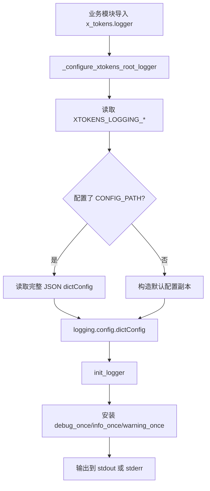
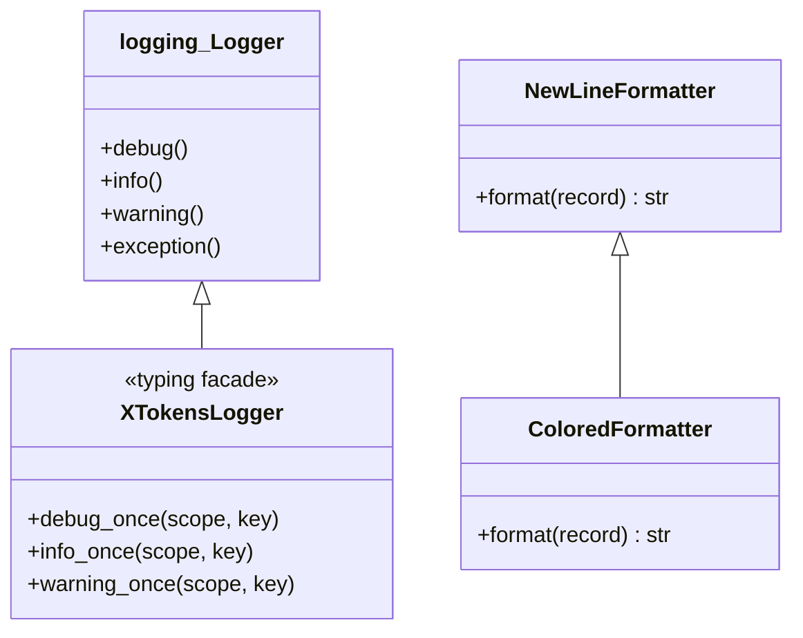
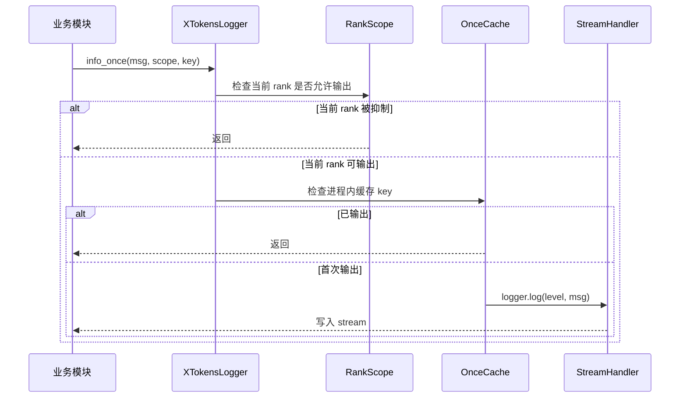

# Design Document

## Summary

xTokens 新增基于 Python 标准库 `logging` 和 `logging.config.dictConfig` 的统一日志系统。核心实现位于 `x_tokens/logger.py`，模块导入时自动、幂等地配置 `x_tokens` 命名空间 logger，提供终端彩色输出、多行对齐、源码路径折叠、`debug_once`、`info_once`、`warning_once` 和多 rank 日志抑制，并允许通过环境变量或完整 JSON `dictConfig` 定制。Serve CLI 同时使用 `create_uvicorn_log_config()` 统一 Uvicorn error/access 日志。实现只管理 xTokens 及显式接入的 Uvicorn logger，不接管 Python 全局 root logger，避免 xTokens 作为库被导入时改变宿主应用的日志行为。

## Background

当前 `x_tokens.entrypoints.serve.generation` 和 `x_tokens.entrypoints.serve.openai.routes` 直接通过 `logging.getLogger(__name__)` 获取 logger，但项目没有统一 handler、formatter、日志级别和输出流配置。Serve CLI 调用 `uvicorn.run()` 时也沿用 Uvicorn 默认日志配置，导致服务框架和业务模块的日志格式、颜色规则及配置入口不一致。

xTokens 同时可能作为 Python 库被其他服务导入，因此不能直接配置全局 root logger。当前 executor 也尚未提供稳定的 distributed context；多 rank 日志抑制需要先建立不依赖 PyTorch 的接口，并兼容分布式启动器常见的 `RANK` 和 `LOCAL_RANK` 环境变量。

benchmark 中的 `print()` 用于向用户展示测试结果，不属于运行日志，本设计不迁移这些输出。

## Goals

- 为所有 `x_tokens.*` 模块提供统一、简单的 `init_logger(__name__)` 接口。
- 默认将日志输出到 stdout，并统一时间、调用位置和消息格式。
- 根据 TTY 和环境变量启用或关闭 ANSI 彩色输出。
- 对多行消息和异常堆栈进行可读的续行对齐。
- 在 DEBUG 日志中显示折叠后的包内相对路径，其他级别显示文件名。
- 提供有界缓存的 `debug_once`、`info_once` 和 `warning_once`。
- 定义 `process`、`local` 和 `global` 三种日志去重 scope。
- 支持环境变量调整默认配置，以及通过 JSON `dictConfig` 完整接管日志。
- 统一 Uvicorn error/access 日志格式，并保留 `--no-access-log` 行为。
- 通过测试验证初始化幂等性、格式化、去重、rank 抑制和配置覆盖。

## Non-goals

- 不内置 JSON、文件轮转或远程日志 handler；用户可通过自定义 `dictConfig` 配置。
- 不实现跨进程共享的 once 缓存；跨进程抑制由 rank scope 完成。
- 不修改 benchmark 和命令行报告中的 `print()`。
- 不在本次改动中实现 `sys.settrace` 函数调用追踪。该功能开销和风险较高，后续应放入独立的 `x_tokens/tracing.py`。
- 不新增日志 CLI 参数；初始化发生在配置对象构造之前，第一版使用环境变量控制。

## Design Overview

日志系统由配置加载、formatter、logger 扩展和 Uvicorn 配置四部分组成：

```text
业务模块 import x_tokens.logger
    ↓
_configure_xtokens_root_logger()
    ↓
环境变量 / JSON dictConfig
    ↓
x_tokens 命名空间 handler 与 formatter
    ↓
init_logger(__name__) 安装 *_once 方法
```

默认配置只给 `x_tokens` logger 安装 handler，并设置 `propagate=False`。`transformers`、`httpx` 和 `httpcore` 的有效级别压低到 WARNING，但不为其安装 xTokens handler。Serve CLI 将 `create_uvicorn_log_config()` 返回的合并配置传给 `uvicorn.run()`，由同一套 formatter 管理 Uvicorn 日志。



## Detailed Design

### Core Flow

`x_tokens/logger.py` 完成所有类和函数定义后，在文件底部调用一次：

```python
_configure_xtokens_root_logger()
```

初始化使用进程内锁和 `_configured` 标记保证幂等。默认流程为：

1. 读取并校验日志环境变量。
2. 如果配置了 `XTOKENS_LOGGING_CONFIG_PATH`，加载完整 JSON 对象。
3. 否则深拷贝 `DEFAULT_LOGGING_CONFIG`，应用日志级别、stream、prefix 和颜色设置。
4. 调用 `logging.config.dictConfig()`。
5. 标记初始化完成。

配置文件不存在、JSON 无效或字段类型错误时抛出 `RuntimeError`，避免生产环境静默回退到错误配置。自定义 JSON 配置表示完整接管，不与默认配置合并。

`init_logger(name)` 调用 `logging.getLogger(name)`，并使用 `types.MethodType` 幂等安装三个 once 方法。该方案不会调用 `logging.setLoggerClass()`，因此不会改变外部库创建的 logger 类型。

### Interfaces and Data Structures

公开接口如下：

```python
LogScope = Literal["process", "local", "global"]

def init_logger(name: str) -> XTokensLogger: ...

def set_logging_rank_context(
    *,
    global_rank: int,
    local_rank: int,
) -> None: ...

def create_uvicorn_log_config() -> dict[str, Any]: ...
```

`XTokensLogger` 是用于静态类型检查的 `logging.Logger` 扩展类型，在标准接口之上增加：

```python
def debug_once(
    msg: object,
    *args: object,
    scope: LogScope = "process",
    key: object | None = None,
    **kwargs: object,
) -> None: ...
```

`info_once` 和 `warning_once` 使用相同签名。默认缓存 key 由 logger 名称、日志级别、消息模板和参数的稳定表示组成；调用者可以通过 `key` 将包含动态数据的多条消息归并。缓存使用有界 LRU，防止长时间运行时因高基数消息无限增长。

scope 语义如下：

| Scope | 输出规则 |
|---|---|
| `process` | 每个 OS 进程分别输出一次 |
| `local` | 仅 `local_rank == 0` 的进程输出一次 |
| `global` | 仅 `global_rank == 0` 的进程输出一次 |

rank 默认从 `RANK` 和 `LOCAL_RANK` 环境变量读取，缺省值为 0。executor 建立分布式上下文后可以调用 `set_logging_rank_context()` 覆盖环境变量结果；logger 不直接依赖 PyTorch。

支持的环境变量：

| 环境变量 | 默认值 | 说明 |
|---|---|---|
| `XTOKENS_LOGGING_LEVEL` | `INFO` | xTokens 日志级别 |
| `XTOKENS_LOGGING_STREAM` | `stdout` | `stdout` 或 `stderr` |
| `XTOKENS_LOGGING_PREFIX` | 空字符串 | 放在消息正文之前的固定前缀 |
| `XTOKENS_LOGGING_COLOR` | `auto` | `auto`、`0` 或 `1` |
| `XTOKENS_LOGGING_CONFIG_PATH` | 未设置 | 完整 JSON `dictConfig` 路径 |
| `NO_COLOR` | 未设置 | 存在时强制关闭颜色 |

`NO_COLOR` 优先级最高。`XTOKENS_LOGGING_COLOR=auto` 根据目标 stream 的 `isatty()` 返回值决定是否启用颜色。

默认格式为：

```text
%(levelname)s %(asctime)s [%(fileinfo)s:%(lineno)d] %(message)s
```

其中时间格式为 `%m-%d %H:%M:%S`。`NewLineFormatter` 负责设置 `fileinfo`、消息 prefix 和续行缩进；`ColoredFormatter` 在此基础上为级别和时间戳着色。DEBUG 记录的 `fileinfo` 使用相对于 `x_tokens` 包目录的路径，路径过长时保留首层和最后三层；其他级别只显示文件名。

`create_uvicorn_log_config()` 在默认配置副本中加入 `uvicorn`、`uvicorn.error` 和 `uvicorn.access` logger。access 日志使用 Uvicorn 提供给 LogRecord 的 `client_addr`、`request_line` 和 `status_code` 字段。配置自定义 JSON 时，该函数原样返回用户配置，由用户决定 Uvicorn handler 和格式。

### Class, Sequence, and State Diagrams





### Compatibility and Migration

现有生产模块由：

```python
import logging

logger = logging.getLogger(__name__)
```

迁移为：

```python
from x_tokens.logger import init_logger

logger = init_logger(__name__)
```

本次迁移 `x_tokens.entrypoints.serve.generation` 和 `x_tokens.entrypoints.serve.openai.routes`。Serve CLI 增加 Uvicorn `log_config` 参数。公开 HTTP API、请求配置和模型配置均不改变，不属于破坏性变更。

默认服务日志格式从 Uvicorn 和 Python logging 各自默认格式变为 xTokens 统一格式。`x_tokens` logger 设置 `propagate=False`，上层应用如果需要完全接管，可设置 `XTOKENS_LOGGING_CONFIG_PATH`。

回滚时删除 `log_config` 参数并将业务模块恢复为标准 `logging.getLogger()` 即可，不涉及持久化数据迁移。

## Testing and Evaluation

单元测试覆盖：

- 默认格式、时间、调用文件和行号。
- stdout/stderr、TTY 自动颜色、强制颜色及 `NO_COLOR`。
- 多行消息和异常堆栈的续行对齐。
- INFO 文件名和 DEBUG 相对路径折叠。
- once 方法的同消息去重、不同 key 区分和有界缓存。
- `process`、`local` 和 `global` scope 的 rank 抑制。
- 重复初始化不增加 handler。
- 自定义 JSON 配置完整接管及非法配置快速失败。
- Uvicorn error/access logger 配置和 `access_log=False` 传递。
- 现有 generation exception 日志行为不回退。

导入时初始化和环境变量组合使用 subprocess 隔离测试，避免 pytest 进程中全局 logging 状态相互影响。Python 代码运行 ruff，相关测试运行 pytest。

本次变更不是性能优化，不要求 GPU Benchmark。关闭级别的标准 logging 调用仍保持延迟格式化，不在调用点构造完整消息。

最终验证结果：全量 `pytest -q` 共 54 项测试通过；本次修改涉及的 Python 文件通过 `ruff check`。全仓 `ruff check .` 仍被 benchmark 目录中 9 个与本设计无关的既有问题阻塞，包括未使用变量、导入排序和宽泛异常捕获，本次改动未扩大范围处理这些问题。

## Trade-offs and Known Issues

### Advantages

- 完全基于 Python 标准 logging，外部依赖少，用户可复用标准生态 handler。
- 只管理 `x_tokens` 命名空间，适合作为库嵌入其他应用。
- 默认开发体验统一，同时保留完整 `dictConfig` 接管能力。
- once cache 有容量上限，不会因动态日志无限增长。
- rank context 与 PyTorch 解耦，后续可接入任意 executor。

### Limitations

- once cache 是每个进程独立的，不能跨进程共享状态。
- distributed context 未设置时依赖 `RANK` 和 `LOCAL_RANK` 环境变量的正确性。
- 导入 `x_tokens.logger` 会执行配置，仍然存在受控的 import-time side effect。
- 自定义 JSON 配置由用户完全负责，xTokens 不自动补充 Uvicorn logger。
- 函数级 tracing 不在本次实现范围内。

### Trade-offs

配置全局 root logger 可以自然捕获所有第三方日志，但会改变宿主应用行为，因此本设计选择命名空间 logger，并只在 Serve CLI 显式接管 Uvicorn。动态给单个 logger 安装 once 方法比 `logging.setLoggerClass()` 多少有一些运行时封装成本，但避免全局改变外部 logger 类型，且 logger 对象由 logging 缓存，安装只发生一次。

## Conclusion

本设计通过 `x_tokens/logger.py` 建立统一而受控的日志基础设施，覆盖服务运行所需的格式化、环境配置、消息去重、rank 抑制和 Uvicorn 接入，同时避免影响宿主应用的全局 logging。实现完成后，xTokens 生产模块将统一使用 `init_logger(__name__)`；函数追踪和更多结构化 handler 留给后续独立设计。

## Completion Criteria

- 设计文档与最终 `logger.py`、CLI 接入和模块迁移保持一致。
- `init_logger()`、formatter、once scope 和 Uvicorn 配置具有自动化测试。
- 环境变量和自定义 JSON 配置行为经过 subprocess 测试。
- 相关 pytest 测试通过。
- 修改过的 Python 文件通过 ruff 检查。
- 未修改 benchmark 的展示输出和无关用户文件。
