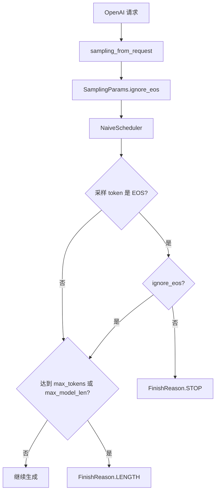
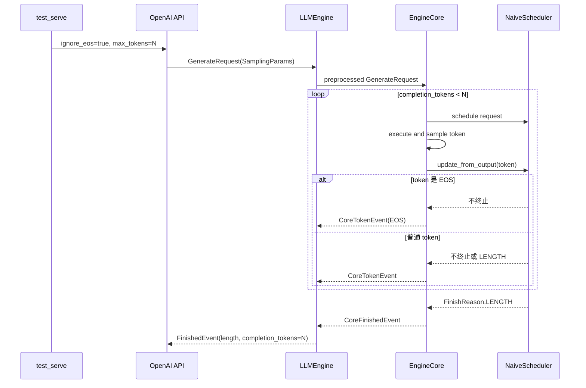
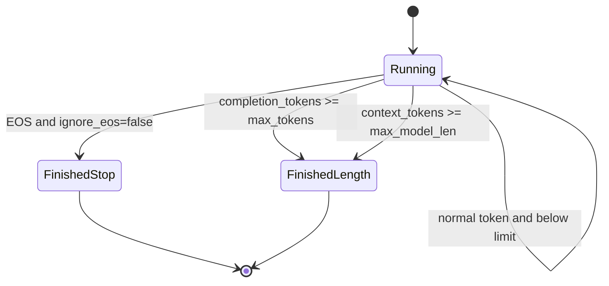

# Design Document

## Summary

xTokens 为 Completion 和 Chat Completion 请求新增 `ignore_eos` 参数，并将其贯通至协议无关的 `SamplingParams`、`NaiveScheduler` 和 `EngineCore`。当 `ignore_eos=false` 时保持现有行为，采样到任一模型 EOS token 后以 `finish_reason=stop` 结束；当 `ignore_eos=true` 时，EOS token 作为普通生成 token 计入 completion、加入后续模型上下文并继续生成，请求最终由 `max_tokens` 以 `finish_reason=length` 结束。`max_model_len` 仍是不可越过的安全边界。Serving benchmark 同时增加 `--ignore-eos` 便捷开关，用于 eval 场景稳定生成指定数量的 token。

## Background

当前 serving benchmark 可以通过 `extra_body={"ignore_eos": true}` 向目标服务透传任意请求字段，但 xTokens 的 `CompletionRequest` 和 `ChatCompletionRequest` 没有定义 `ignore_eos`。Pydantic 会忽略这个额外字段，`sampling_from_request()` 也无法将其传入 engine。

Core 中存在两处 EOS 固定行为：`NaiveScheduler.update_from_output()` 遇到 EOS 后无条件将请求标记为 `FinishReason.STOP`；`EngineCore.step_fn()` 无条件过滤 EOS token event。因此，仅在 API 层增加字段无法完成该能力。

eval 和 serving benchmark 常要求每个请求生成相同数量的 token，以稳定比较吞吐、TPOT 和调度行为。模型自然生成 EOS 会造成输出长度不一致，因此需要按请求控制是否忽略 EOS。

## Goals

- Completion 和 Chat Completion API 接受布尔参数 `ignore_eos`。
- 将 `ignore_eos` 保存到协议无关的 `SamplingParams`。
- 同一 batch 中允许普通请求和 ignore-EOS 请求使用不同终止语义。
- `ignore_eos=true` 时，采样到 EOS 不结束请求，并继续生成到 `max_tokens`。
- 被忽略的 EOS token 计入 completion token 数量并加入下一步上下文。
- `ignore_eos=true` 的正常长度终止返回 `finish_reason=length`。
- 默认值为 `false`，保持所有已有调用者的 EOS 行为。
- serving benchmark 提供 `--ignore-eos`，并继续兼容 `--extra-body`。
- 通过 Scheduler、EngineCore、LLMEngine、API 和 benchmark CLI 测试验证完整链路。

## Non-goals

- 不改变 tokenizer 的 EOS token 定义，也不新增 per-request EOS token ID。
- 不支持忽略用户提供的 stop string；当前 HF EngineCore 仍不支持 stop string。
- 不允许生成上下文超过 `max_model_len`。
- 不改变 EOS token 的文本解码规则；`TokenizerOutputProcessor` 继续使用 `skip_special_tokens=True`，因此 EOS 通常不会产生可见文本。
- 不让 serving benchmark 默认开启该功能，避免改变普通生成语义。

## Design Overview

`ignore_eos` 是请求级 sampling 参数，沿现有请求转换链路向下传递：

```text
OpenAI CompletionRequest / ChatCompletionRequest
    ↓
sampling_from_request()
    ↓
SamplingParams.ignore_eos
    ↓
GenerateRequest
    ↓
NaiveScheduler.update_from_output()
    ↓
EngineCore.step_fn()
```

Scheduler 是终止条件的唯一决策者。EngineCore 根据同一个请求参数决定是否向 Engine 层发送 EOS token event，避免 Scheduler 已继续运行但输出路径仍丢弃 token。



## Detailed Design

### Core Flow

API DTO 增加：

```python
ignore_eos: bool = False
```

`sampling_from_request()` 将它复制到 `SamplingParams`：

```python
SamplingParams(
    ...,
    ignore_eos=request.ignore_eos,
)
```

Scheduler 每一步先将采样 token 追加到 `output_token_ids`，因此 EOS 与其他 token 一样计入 completion。终止判断调整为：

```python
if token_id in eos_token_ids and not request.request.sampling.ignore_eos:
    finish_reason = FinishReason.STOP
elif (
    request.completion_tokens >= request.request.sampling.max_tokens
    or len(request.context_token_ids) >= self._max_model_len
):
    finish_reason = FinishReason.LENGTH
```

当 `ignore_eos=true` 时，即使 EOS 恰好是第 `max_tokens` 个 token，也应进入长度判断并返回 `FinishReason.LENGTH`。

EngineCore 根据请求语义决定 token event：

```python
is_eos = token_id in self._executor.eos_token_ids
if not is_eos or request.request.sampling.ignore_eos:
    outputs.add(CoreTokenEvent(...))
```

这样忽略的 EOS 会经过 `LLMEngine` 和 `OutputProcessor`。它通常被 tokenizer 的 `skip_special_tokens=True` 解码为空字符串，但仍会保留 token 计数和上下文语义。

Serving benchmark 增加 `--ignore-eos`。CLI 将其合并到 `extra_body`：

```python
extra_body = dict(args.extra_body or {})
if args.ignore_eos:
    extra_body["ignore_eos"] = True
```

显式 CLI 开关优先于 `--extra-body` 中的同名值；未指定开关时完整保留 `--extra-body` 的原始值。

### Interfaces and Data Structures

`SamplingParams` 新增字段并放在现有字段末尾，避免改变已有位置参数含义：

```python
@dataclass(frozen=True, slots=True)
class SamplingParams:
    max_tokens: int = 16
    temperature: float = 1.0
    top_p: float = 1.0
    top_k: int | None = None
    stop: tuple[str, ...] = ()
    ignore_eos: bool = False
```

OpenAI DTO：

```python
class CompletionRequest(BaseModel):
    ...
    ignore_eos: bool = False

class ChatCompletionRequest(BaseModel):
    ...
    ignore_eos: bool = False
```

HTTP 示例：

```json
{
  "model": "Qwen3-30B-A3B",
  "prompt": "hello",
  "max_tokens": 128,
  "ignore_eos": true
}
```

benchmark CLI 示例：

```bash
python -m test_serve \
  --backend openai \
  --endpoint http://127.0.0.1:8000 \
  --output-len 128 \
  --ignore-eos
```

### Class, Sequence, and State Diagrams



每个请求独立读取自己的 `SamplingParams.ignore_eos`，因此 batch 内状态不需要新增全局模式：



### Compatibility and Migration

新增字段均有默认值 `false`，现有 Python 调用、HTTP 请求和 benchmark 行为不变。`SamplingParams` 将字段追加到末尾，不改变现有位置参数对应关系。

`ignore_eos=true` 是显式行为变更：原先 EOS 以 `stop` 结束且不产生 token event；新行为将 EOS 计入输出数量并继续生成，最后通常返回 `length`。这不是公开 API 的破坏性变更。

如果 prompt 加目标输出长度超过 `max_model_len`，请求仍会在模型上下文上限处返回 `length`，可能少于请求的 `max_tokens`。eval 调用者应保证：

```text
prompt_tokens + max_tokens <= max_model_len
```

回滚时删除 DTO 和 `SamplingParams` 字段，并恢复 Scheduler/EngineCore 的固定 EOS 判断即可，不涉及持久化数据迁移。

## Testing and Evaluation

- DTO/adapter 测试：Completion 和 Chat Completion 的 `ignore_eos` 正确进入 `SamplingParams`，默认值为 false。
- Scheduler 单元测试：普通请求遇 EOS 返回 `STOP`；ignore-EOS 请求遇 EOS 继续运行，并在 `max_tokens` 返回 `LENGTH`。
- 混合 batch 测试：相同 EOS token 对不同请求产生不同终止结果。
- EngineCore 测试：ignore-EOS 请求会发出 EOS `CoreTokenEvent`，最终 completion token 数等于 `max_tokens`。
- LLMEngine 测试：EOS 连续出现时仍生成指定步数，并返回 `FinishedEvent(LENGTH)`。
- Serve API 测试：HTTP 请求字段正确传到 FakeEngine。
- benchmark CLI 测试：`--ignore-eos` 合并为 `extra_body["ignore_eos"] = true`，且不破坏其他 extra body 字段。
- 回归测试：全量 pytest 和相关文件 ruff 检查通过。

本功能只增加请求级布尔判断，不改变模型 forward 或采样复杂度，不需要性能 Benchmark。

最终验证结果：全量 `pytest -q` 共 59 项测试通过；本次修改涉及的 Python 文件通过 `ruff check` 和 `ruff format --check`。

## Trade-offs and Known Issues

### Advantages

- eval 可以稳定控制生成 token 数量，减少 EOS 导致的 workload 方差。
- 参数是 per-request 的，普通流量和 eval 流量可以共享同一服务实例。
- 默认关闭，兼容现有服务行为。
- 实现位于 sampling 和终止决策边界，不依赖具体模型。

### Limitations

- EOS 仍占用一个 completion token，但通常不会产生可见文本。
- `max_model_len` 可以在 `max_tokens` 前触发安全终止。
- 模型连续采样 EOS 时会继续执行到长度限制，这是 eval 所需行为，但不适合普通用户请求。
- 当前 stop string 尚未实现，`ignore_eos` 不改变该限制。

### Trade-offs

另一种方案是在请求进入 Core 时把 EOS token 集合替换为空集合，但这会把 per-request 行为提升成 batch 或 executor 级配置，不适合混合请求。当前方案在 Scheduler 和 EngineCore 中按请求判断，增加一次轻量布尔分支，但保留正确的 batch 独立语义。

被忽略的 EOS 可以只计数而不发送 token event，但这样 OutputProcessor 维护的 token 序列与模型真实上下文不一致，也不利于调试。因此本设计将其作为普通 `CoreTokenEvent` 发送，由 tokenizer 决定是否产生可见文本。

## Conclusion

本设计将 `ignore_eos` 作为请求级 `SamplingParams` 贯通 API、Engine 和 Core。开启后 EOS 不再是终止条件，请求由 `max_tokens` 控制正常结束，并保留 `max_model_len` 安全限制。Serving benchmark 的专用 CLI 开关使该能力可直接用于固定输出长度的 eval。

## Completion Criteria

- 设计文档与 DTO、`SamplingParams`、Scheduler、EngineCore 和 benchmark CLI 最终实现一致。
- 普通请求 EOS 行为保持不变。
- ignore-EOS 请求在连续 EOS 输入下生成到 `max_tokens` 并返回 `length`。
- 混合 batch 的 per-request 行为有测试覆盖。
- Completion、Chat Completion 和 benchmark CLI 参数链路有测试覆盖。
- 相关 ruff 检查和全量 pytest 通过。
