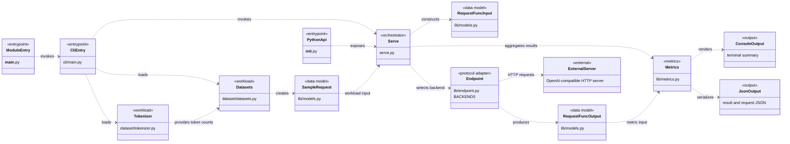

# `test_serve` 独立 Serving Benchmark 设计

实现位置：`/Code/xTokens/benchmarks/test_serve`

`test_serve` 是一个独立的异步 benchmark client，用于压测已经运行的 OpenAI-compatible HTTP 服务。它不导入、不启动、不配置 vLLM 或 xTokens；模型、GPU、调度器、KV cache 和服务端生命周期均由外部服务负责。

## 1. 功能

### 1.1 支持的 API

| backend | 请求路径 | 响应方式 |
| --- | --- | --- |
| `openai`、`vllm` | `/v1/completions` | SSE 流式生成 |
| `openai-chat`、`chat` | `/v1/chat/completions` | SSE 流式生成 |
| `openai-embeddings`、`embeddings` | `/v1/embeddings` | JSON |
| `vllm-rerank`、`rerank` | `/v1/rerank` | JSON |

生成接口会请求 `stream: true` 和 `stream_options.include_usage: true`。SSE 解析器支持 event 被拆分到多个 TCP chunk、一个 chunk 包含多个 event，以及 `data: [DONE]` 结束标记。

### 1.2 数据集与流量

`dataset.load_samples()` 将所有数据统一为 `list[SampleRequest]`。支持：

- `random`：确定性生成文本；
- `random-mm`：文本加简单结构化 content；
- `prefix_repetition`：共享 prefix、独立 suffix，随后按 seed 打乱；
- `sharegpt`、`custom`、`trace`：读取本地 JSON、JSONL 或 CSV；
- 其他名称：作为 Hugging Face Hub dataset ID，通过 `datasets.load_dataset()` 下载并加载指定 split。

Hub 数据集使用 `--dataset-config` 选择配置，使用 `--dataset-split` 选择 split（默认 `train`）。它与本地数据集共用 `_sample_rows()`，因此会按相同规则提取 `prompt`/`text`/`question`/`input`/`messages`，估算 token 长度，打乱数据，并应用 `--num-prompts` 和 `--no-oversample`。

请求到达模式：

- `request_rate=inf`：立即创建全部请求任务；
- `burstiness=inf`：固定间隔 `1 / request_rate`；
- 其他有限 `burstiness`：Gamma 分布间隔，均值为 `1 / request_rate`；`burstiness=1` 是 Poisson 到达过程；
- `self_timed=True` 且样本有 `timestamp`：将 timestamp 作为相对发送时间；缺失 timestamp 的样本仍按 request rate 调度。

`--max-concurrency` 同时限制 `aiohttp.TCPConnector` 的连接数和 `asyncio.Semaphore` 的执行并发。

### 1.3 请求配置与结果

- 未传 `model` 时，先从 `/v1/models` 选择第一个模型。若该接口返回 404/405，则查询 `/status`，从 `prefill_nodes` 或 `decode_nodes` 的后端继续查询 `/v1/models`。
- 默认执行 readiness check：使用第一个样本发送真实请求，每 2 秒重试，直到成功或超时。
- 支持 warmup、`temperature`、`top_p`、`top_k`、`logprobs`、额外请求体和额外 Header。
- `OPENAI_API_KEY` 会转换为 `Authorization: Bearer ...`；自定义 Header 可以覆盖它；有 request ID 时会写入 `x-request-id`。
- 全局 `extra_body` 与 `SampleRequest.request_overrides` 合并，单请求覆盖项优先。
- 输出成功数、失败数、请求/Token 吞吐、峰值并发、latency、TTFT、TPOT、ITL、百分位数、goodput 和逐请求明细。

指标由客户端测量。生成请求中，TTFT 是首个非空文本 delta 到达时间，ITL 是相邻非空文本 delta 的间隔，E2EL/latency 是最后一个非空文本 delta 到达时间。一个 SSE delta 可能携带多个 token，因此 ITL/TPOT 是 delta 级近似，不是严格逐 token 指标。

Embedding/Rerank 是非流式 JSON 请求：完整响应 latency 同时被记录为 TTFT。服务端 usage 中的 `prompt_tokens`/`input_tokens` 会覆盖本地输入长度估算；没有 output usage 时，生成输出 token 数回退为收到的生成事件数量。

## 2. 架构

### 2.1 目录结构

```text
test_serve/
├── __init__.py               # 导出 Python API
├── __main__.py               # `python -m test_serve` 入口
├── serve.py                  # 调度、模型发现、ready check、warmup、并发、结果组装
├── cli/
│   └── main.py               # argparse、数据集加载、调用 benchmark、保存 JSON
├── dataset/
│   ├── datasets.py           # 内置、本地和 Hugging Face Hub 数据集 -> SampleRequest
│   └── tokenizer.py          # BasicTokenizer 和可选 HuggingFace tokenizer
├── lib/
│   ├── models.py             # SampleRequest、RequestFuncInput、RequestFuncOutput
│   ├── endpoint.py           # backend 映射、HTTP 请求、SSE/JSON 解析
│   └── metrics.py            # 吞吐、延迟、百分位数、goodput
└── tests/
    └── test_standalone.py    # 标准库 mock server 测试
```

### 2.2 组件架构



入口层负责解析 CLI 或暴露 Python API；工作负载层将数据转换为 `SampleRequest`；`serve.py` 负责调度和组装 backend 无关的请求输入；协议适配层按 `BACKENDS` 选择 API 路径及 SSE/JSON 解析器；指标层汇总 `RequestFuncOutput` 并输出终端和 JSON 结果。外部服务只通过 HTTP 协议与 benchmark client 交互。

### 2.3 核心模型

```text
SampleRequest
  数据集标准输出：prompt、prompt_len、expected_output_len、timestamp、
  request_id、chat_messages、multi_modal_data、request_overrides。

RequestFuncInput
  `serve.py` 为每个请求构造的 backend 无关输入：API URL、模型、
  采样参数、Header、请求体和多模态/Chat 内容。

RequestFuncOutput
  endpoint adapter 的单请求输出：success、status_code、prompt/output token、
  TTFT、ITL、latency、start_time、error。
```

`lib.endpoint.BACKENDS` 将 backend 名称映射为 `(URL suffix, async request function)`，使 `serve.py` 不依赖具体 API 协议。

### 2.4 边界和限制

当前代码不提供：

- 服务启动/停止、GPU 或模型配置；
- ramp-up、Timeline、可视化和服务端 Prometheus 指标采集；
- 图片、音频、base64 等多模态文件加载；
- LoRA 动态选择。

HTTP、超时和 SSE/JSON 解析错误通常会转换为 `RequestFuncOutput.error` 并纳入失败统计。但 Rerank 输入不是至少两个元素的 list 时，`request_rerank()` 会抛出 `EndpointError`；该异常会经 `asyncio.gather()` 传播并终止本次 benchmark，而不是作为单请求失败结果返回。

## 3. 使用方法

### 3.1 环境与服务

运行环境需要 Python 3.10+ 与 `aiohttp`：

```bash
source /Code/xTokens/.venv/bin/activate
```

若需要加载 Hugging Face Hub 数据集，安装 benchmark 可选依赖：

```bash
uv pip install --python .venv/bin/python -e '.[benchmark]'
```

也可直接安装 `datasets`。未安装该包不会影响 `random`、`prefix_repetition` 和本地数据集模式。若需要本地 Hugging Face tokenizer，额外安装 `transformers` 并传入 `--tokenizer`；未指定 tokenizer 时使用按空白字符分词的 `BasicTokenizer`，只用于长度估计。

在项目根目录完成上述安装后，可直接运行 `python -m test_serve`，无需设置 `PYTHONPATH`。

```bash
vllm serve <model> --host 127.0.0.1 --port 8000
```

### 3.2 CLI

从项目根目录运行：

```bash
python -m test_serve \
  --backend openai-chat \
  --endpoint http://127.0.0.1:8000 \
  --dataset-name random \
  --num-prompts 100 \
  --input-len 128 \
  --output-len 32 \
  --request-rate 10 \
  --max-concurrency 8 \
  --num-warmups 2 \
  --save-result result.json \
  --save-requests requests.json
```

终端默认显示正式请求的完成进度；模型发现、readiness check 和 warmup 不计入进度条。将输出重定向到文件或在 CI 中运行时，可传 `--no-progress` 关闭它。

常用参数：

| 参数 | 说明 |
| --- | --- |
| `--backend` | API 类型，默认 `openai-chat` |
| `--model` | 模型 ID；省略时自动发现 |
| `--dataset-name` / `--dataset` | 数据集类型，默认 `random` |
| `--dataset-path` | `sharegpt`、`custom`、`trace` 的本地 `json`、`jsonl` 或 `csv` 路径 |
| `--dataset-config` | Hugging Face Hub 数据集配置名 |
| `--dataset-split` | Hugging Face Hub 数据集 split，默认 `train` |
| `--request-rate` | 目标 RPS，默认 `inf` |
| `--burstiness` | Gamma 分布形状参数，默认 `1.0` |
| `--max-concurrency` | 最大客户端并发 |
| `--self-timed` | 采用 trace 的 timestamp |
| `--ready-timeout` | readiness check 和请求总超时，默认 60 秒 |
| `--no-ready-check` | 跳过 readiness check |
| `--no-progress` | 关闭按已完成请求数更新的终端进度条 |
| `--extra-body` | JSON 对象形式的额外请求字段 |
| `--header` | `NAME=VALUE`，可重复传入 |
| `--percentiles` | 如 `50,90,99` |
| `--goodput` | 如 `ttft=200` 或 `e2el=1000`，单位 ms |

### 3.3 数据集示例

最大压力：

```bash
python -m test_serve \
  --endpoint http://127.0.0.1:8000 \
  --dataset-name random \
  --request-rate inf
```

Prefix repetition：

```bash
python -m test_serve \
  --dataset-name prefix_repetition \
  --prefix-len 256 \
  --suffix-len 256 \
  --num-prefixes 10
```

Hugging Face Hub 数据集：

```bash
python -m test_serve \
  --dataset-name HuggingFaceH4/ultrachat_200k \
  --dataset-config default \
  --dataset-split train_sft \
  --num-prompts 100
```

数据集记录必须包含可转换为文本的 `prompt`、`text`、`question`、`input` 或 `messages` 字段。对其他 schema，应先在 Hub 上使用合适的 config/split，或导出为 `custom` 格式。

### 3.4 本地 JSONL

```bash
python -m test_serve \
  --dataset-name custom \
  --dataset-path requests.jsonl
```

可用记录字段：

```json
{
  "prompt": "hello",
  "prompt_len": 1,
  "output_len": 16,
  "request_id": "case-1",
  "timestamp": 0.2,
  "request_overrides": {"top_p": 0.8}
}
```

`prompt` 也可以写为 `text`、`question`、`input`，或使用 `messages`。`trace` 数据集配合 `--self-timed` 使用 `timestamp` 回放请求时间。

### 3.5 Python API

```python
import asyncio

from test_serve.dataset import BasicTokenizer, load_samples
from test_serve.serve import benchmark


async def main() -> None:
    samples = load_samples(
        "random",
        num_prompts=100,
        input_len=128,
        output_len=32,
        tokenizer=BasicTokenizer(),
    )
    result = await benchmark(
        samples,
        backend="openai-chat",
        base_url="http://127.0.0.1:8000",
        request_rate=10,
        max_concurrency=8,
        extra_body={"ignore_eos": True},
        goodput_config={"ttft": 200, "e2el": 1000},
    )
    print(result)


asyncio.run(main())
```

结果字典包含汇总指标和 `requests`。每条请求明细包含：

```text
request_id, success, latency_ms, ttft_ms, itl_ms,
input_tokens, output_tokens, error
```

### 3.6 测试

现有测试使用标准库 mock server 覆盖随机数据集、基础指标、无限速率调度和 Chat SSE 请求：

```bash
python -m unittest test_serve.tests.test_standalone
```
