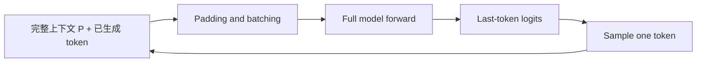
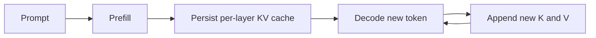

# LLM 推理 HBM 与最大并发分析

## 目录

- [1. 结论](#1-结论)
- [2. 符号与计算口径](#2-符号与计算口径)
- [3. 两种路径共有的显存](#3-两种路径共有的显存)
- [4. 情况一：无 KV cache](#4-情况一无-kv-cache)
- [5. 情况二：有 KV cache](#5-情况二有-kv-cache)
- [6. Qwen3-30B-A3B 示例](#6-qwen3-30b-a3b-示例)
- [7. 计算最大并发的推荐流程](#7-计算最大并发的推荐流程)
- [8. 可直接落地的判断](#8-可直接落地的判断)

## 1. 结论

仅根据 GPU 显存容量和模型参数量，不能直接得到推理系统的最大并发数。二者只能确定
一个初步的显存边界；还必须给定模型结构、数据类型、输入/输出长度、batch 策略、
attention 实现、并行切分方式以及运行时固定开销。

需要分别分析以下两条执行路径：

- **无 KV cache**：每个生成 step 都重新计算完整上下文，没有随历史 token 持久增长的
  KV cache，但峰值 activation、attention 临时张量和 logits 会随本轮 batch 的
  `batch_size × padded_seq_len` 增长。最大并发必须通过一次完整 forward 的峰值显存求解。
- **有 KV cache**：prefill 后保存每层的 K/V，decode 只计算新 token。此时 KV cache
  通常是并发容量的主要约束，最大并发主要由所有活跃请求占用的 cache token 总数决定，
  同时仍需为 prefill/decode activation 和算子 workspace 预留空间。

无论是否使用 KV cache，显存允许的并发都只是 **OOM 上限**。满足 TTFT、TPOT、吞吐量
或 P99 latency 目标的 **有效并发** 仍需通过 benchmark 得到。

## 2. 符号与计算口径

| 符号 | 含义 |
| --- | --- |
| `H_i` | 第 `i` 张 GPU 的物理 HBM 容量 |
| `W_i` | 第 `i` 张 GPU 上的模型权重 |
| `R_i` | CUDA context、通信 buffer、内存池、CUDA Graph 等固定开销 |
| `A_i` | 当前 forward 的 activation 与算子 workspace 峰值 |
| `K_i` | 持久化 KV cache 占用；无 cache 时为 0 |
| `I_i` / `O_i` | 输入 tensor 与输出 logits 占用 |
| `S_i` | 安全余量以及无法准确建模的碎片 |
| `B` | 同时执行的活跃序列数，即 batch size |
| `L_j` | 第 `j` 个请求当前上下文长度 |
| `L_pad` | 当前 batch 的 padding 后长度，通常为 `max(L_j)` |
| `D` | hidden size |
| `N_l` | Transformer 层数 |
| `N_q` / `N_kv` | query head 数 / KV head 数 |
| `D_h` | attention head dimension |
| `V` | vocabulary size |
| `e_a` / `e_kv` | activation / KV cache 每元素字节数 |

每张 GPU 都必须满足：

```text
M_peak_i = W_i + R_i + I_i + O_i + A_i + K_i + S_i <= H_i
```

多卡部署不能只判断 `sum(H_i)` 是否足够。必须分别检查每张卡，最终容量由剩余显存最少、
activation 峰值最高的卡决定。`device_map="auto"`、Tensor Parallel、Pipeline Parallel 和
Expert Parallel 的权重及临时张量分布也不同。

文中的 `GB` 表示十进制 `10^9` bytes，`GiB` 表示二进制 `2^30` bytes。显存计算时应统一
单位，避免把 48 GB 和 48 GiB 混用。

## 3. 两种路径共有的显存

### 3.1 模型权重

```text
W_total ~= parameter_count × weight_bytes_per_parameter + quantization_metadata
```

- BF16/FP16 通常为 2 bytes/parameter。
- FP8/INT8 的原始数据约为 1 byte/parameter，但还有 scale 等量化元数据。
- INT4 的原始数据约为 0.5 byte/parameter，还需考虑 scale、zero point 和 packing 对齐。
- MoE 模型应按**总参数量**计算常驻权重，而不是按每 token 激活参数量计算。激活参数量
  主要影响计算量和权重读取量，不代表未选中的专家可以自动不占显存。

多卡时应使用每张卡实际放置的参数量计算 `W_i`。只用 `W_total / GPU_count` 在层大小不均、
embedding/lm_head 集中放置或 KV heads 发生复制时可能明显失真。

### 3.2 固定运行时开销

`R_i` 通常包括：

- CUDA context、cuBLAS/cuDNN/attention kernel workspace；
- PyTorch caching allocator 已保留但当前未分配的显存；
- NCCL communicator 和 TP/PP/EP 通信 buffer；
- CUDA Graph capture 的静态输入输出及 graph private pool；
- 框架元数据、采样 buffer 和临时 kernel buffer。

这些开销不能从模型参数量推导，必须在模型加载、warmup 和 graph capture 后测量。生产配置
还应保留安全余量 `S_i`，而不是把最后一个可用 byte 全部分配给请求。

### 3.3 Activation 不能只按两个 hidden tensor 估算

推理使用 `inference_mode` 时不需要像训练一样为 backward 保存所有层的 activation。
Transformer 层又是顺序执行的，因此正常情况下峰值 activation **不会简单乘以层数**。
但是，它也不等于固定的两个 `(B, L, D)` tensor。某一层执行期间可能同时存在：

- residual、norm 输入输出；
- Q、K、V projection 结果和 RoPE 临时结果；
- attention 输出或未融合实现中的 attention score/probability；
- MLP/MoE 的 gate、up、激活值、router、dispatch 和 combine buffer；
- lm_head logits、sampling tensor；
- GEMM、FlashAttention、通信算子的 workspace。

所以 `A_i` 应由具体 kernel 和执行图决定。公式适合说明量级，最终应使用实际峰值测量校准。

## 4. 情况一：无 KV cache

### 4.1 执行流程

自回归生成第 `t` 个 token 时，模型重新读取 prompt 和此前生成的全部 token：



这里的“无 KV cache”只表示历史 K/V 不跨 step 持久保存。当前 forward 内部仍然需要临时生成
每层的 Q/K/V，执行结束后才释放或复用这些空间。

### 4.2 峰值显存模型

当前 batch 左 padding 到最长上下文时：

```text
L_pad = max(L_1, L_2, ..., L_B)
processed_tokens_per_step = B × L_pad

M_no_kv_i(B, L_pad)
  = W_i + R_i + I_i(B, L_pad)
  + A_no_kv_i(B, L_pad)
  + O_i(B, L_pad, V)
  + S_i
```

无 KV cache 的显存最大并发不是用一个固定的“每请求显存”相除，而应定义为：

```text
B_hbm_no_kv = max B，使所有 GPU i 都满足 M_no_kv_i(B, L_pad) <= H_i
```

它必须绑定一个目标长度 `L_pad`。只说 `B=32` 而不说明是 512、4K 还是 32K 上下文没有意义。
请求长度不一致时，左 padding 还会让短请求按 batch 中最长请求的长度参与临时 tensor 分配和
计算，因此应使用真实长度分布压测，不能只使用平均长度。

### 4.3 Attention 实现决定线性还是平方级临时空间

若使用 FlashAttention 或 memory-efficient SDPA，不物化完整 attention score 矩阵，
activation 通常近似随 `B × L_pad` 线性增长：

```text
A_no_kv ~= alpha × B × L_pad × model_width_terms × e_a + workspace
```

其中 `alpha` 包含同时存活的 residual、QKV、MLP/MoE 中间结果，不能假设为 2。

若使用 eager attention 并物化 score，单层临时 score 的量级为：

```text
M_attention_score ~= B × N_q × L_pad² × e_a
```

这会使长上下文很快 OOM。例如 `B=1`、`N_q=32`、`L=32K`、BF16 时，单层 score 就约为
64 GiB。GQA 可以减少持久化 K/V，但 query attention score 仍通常按 `N_q` 计算。

### 4.4 Logits 可能成为峰值主项

如果 lm_head 为所有输入位置生成完整 logits：

```text
M_full_logits = B × L_pad × V × e_logits
```

而生成一个新 token 实际只需要最后位置：

```text
M_last_logits = B × V × e_logits
```

对于大词表模型，两者差异很大。应优先使用模型支持的 last-token logits 接口或
`logits_to_keep=1` 一类能力；具体参数名取决于模型实现。还应实际检查 logits 是 BF16/FP16
还是 FP32，FP32 占用是 BF16 的两倍。

### 4.5 无 KV cache 下的计算代价

虽然不保存 KV 可以省掉持久化显存，但它会在每一个 decode step 重算历史：

```text
step t 处理长度 = prompt_length + t
```

因此随着生成进行，单步延迟持续上升。线性层反复处理整个 prefix，attention 也反复计算历史
token 间的关系。实践中系统往往先达到 TPOT 或吞吐量上限，而不是先达到 HBM 上限。

### 4.6 当前 xTokens 实现

当前 `NaiveHFExecutor` 正是无 KV cache 路径：

- `NaiveScheduler` 最多调度 `max_num_seqs` 个 running requests；
- 每一步把每个请求的 `prompt_token_ids + output_token_ids` 组成完整上下文；
- 所有请求左 padding 到当前 batch 的 `max_length`；
- 调用 Hugging Face 模型时显式设置 `use_cache=False`；
- 当前没有 prefill/decode 分离，也没有 `max_num_batched_tokens` 一类 token budget。

因此当前的 `max_num_seqs` 是用户配置的调度上限，不是系统根据 HBM 自动计算出的安全值。
应对 `(B, L_pad)` 组合测量峰值后再配置它。

当前代码在模型 forward 后才取 `.logits[:, -1, :]`，并未请求模型只计算最后位置 logits。
模型实现可能在切片前临时物化 `[B, L_pad, V]`，切片 view 还可能延长底层 storage 的生命周期。
这应作为当前实现的重点测量项，不能只估算 hidden states。

### 4.7 实测前的部署有效性检查

`device_map="auto"` 的 placement 依赖模型加载瞬间的逐卡 free HBM。同一命令在 GPU 空闲和被
临时任务占用时，可能分别产生纯 GPU layer sharding 和大规模 CPU offload。测量前后应检查：

- `CUDA_VISIBLE_DEVICES` 对应的物理 GPU ID/UUID 和现有进程；
- 加载后的 `model.hf_device_map` 与各参数的实际 device；
- 是否出现 `cpu`、`disk` 或 `meta`；出现时不得把结果视为指定 GPU 部署容量；
- 加载后的 `model.config._attn_implementation`，因为加载前 config 可能仍为 `None`；
- forward signature 中 `logits_to_keep` 一类参数的默认值，以及切片 view 的底层 storage bytes。

PyTorch `memory_allocated` 不包含全部 CUDA driver/context 占用。容量计算应记录 warmup 后
`torch.cuda.mem_get_info()` 返回的逐卡真实 free bytes；安全余量从这个 free budget 扣除。

## 5. 情况二：有 KV cache

### 5.1 执行流程



prefill 仍处理 prompt tokens 并产生初始 KV cache；decode 每步通常只输入每条序列的一个新 token，
读取历史 KV 并把新 K/V 追加到 cache 中。

### 5.2 每 token KV cache

不考虑并行切分和对齐时，整个模型每个 token 的逻辑 KV 大小为：

```text
m_kv_token = 2 × N_l × N_kv × D_h × e_kv
```

其中 `2` 表示 K 和 V。需要使用 `N_kv` 而不是 `N_q`；MHA 中二者相等，GQA/MQA 中
`N_kv` 更小。

对于第 `i` 张 GPU，应按它实际负责的本地层数和本地 KV heads 计算：

```text
m_kv_token_i = 2 × N_l_local_i × N_kv_local_i × D_h × e_kv
```

不能无条件除以 TP size。当 `N_kv < TP size` 时，一些实现会在多个 rank 上复制 KV heads；
PP、非均匀 layer placement 或 pipeline 边界也会使各卡占用不同。应以框架实际 cache shape 为准。

### 5.3 连续分配与 paged KV cache

连续 cache 的理想逻辑占用为：

```text
M_kv_i = m_kv_token_i × sum(current_context_length_j)
```

Paged KV cache 以固定 block 分配。若 block size 为 `Q` tokens，则：

```text
allocated_tokens_j = ceil(current_context_length_j / Q) × Q
T_alloc = sum(allocated_tokens_j)
M_kv_i = m_kv_token_i × T_alloc + block_metadata_i
```

最后一个 block 的内部碎片使物理占用高于实际 token 数。若 admission 时为每个请求预留完整
`prompt + max_new_tokens`，则应把 `current_context_length` 换成预留长度。若动态增长并允许抢占，
并发上限则随运行时长度分布变化。

部分引擎会在启动时预分配一个 KV cache pool。此时进程的 HBM 占用看起来是固定的，但 pool
内部的 free blocks 才代表可接纳容量。Prefix cache 或跨请求共享 block 可以减少重复 prefix 的
逻辑占用，但不能作为通用 workload 的容量保证。

### 5.4 有 KV cache 的峰值显存模型

```text
M_with_kv_i
  = W_i + R_i + M_kv_i(T_alloc)
  + max(A_prefill_i(T_chunk), A_decode_i(B))
  + I_i + O_i + S_i
```

- `T_chunk` 是一次 prefill 实际处理的 token 数；启用 chunked prefill 后，它通常受
  `max_num_batched_tokens` 限制，而不是一次处理所有 prompt。
- `A_decode` 一般随活跃序列数 `B` 增长，且远小于重新计算完整上下文的 activation；但仍需
  读取全部历史 KV，decode 性能可能受 HBM bandwidth 限制。
- 普通动态 cache 在扩容/拼接时可能短暂同时保留旧 cache 和新 cache，峰值高于逻辑公式。
  Paged cache 通常能避免整段复制，但仍有 block 对齐和预留开销。

如果为所有请求按相同长度 `L_reserve` 做最坏情况预留，显存理论上限近似为：

```text
M_kv_budget_i
  = H_i - W_i - R_i
    - max(A_prefill_i, A_decode_i) - I_i - O_i - S_i

B_hbm_with_kv
  <= min_i floor(M_kv_budget_i / (m_kv_token_i × L_reserve_aligned))
```

Paged engine 更适合先计算每张卡可用 block 数，再要求所有活跃请求的已分配 block 总数不超过
容量。最终 active concurrency 还应取以下约束的最小值：

```text
B_active <= min(
    HBM/KV block 容量允许的序列数,
    scheduler.max_num_seqs,
    token budget 允许的序列数,
    满足 SLO 的序列数
)
```

## 6. Qwen3-30B-A3B 示例

该模型的关键配置为：

```text
N_l = 48
N_q = 32
N_kv = 4
D_h = 128
D = 2048
V = 151936
BF16 = 2 bytes
```

### 6.1 有 KV cache

整个模型的逻辑 KV cache 为：

```text
m_kv_token
  = 2 × 48 × 4 × 128 × 2
  = 98,304 bytes
  = 96 KiB/token
```

| 单请求上下文 | 逻辑 KV cache |
| ---: | ---: |
| 4,096 tokens | 384 MiB |
| 8,192 tokens | 768 MiB |
| 32,768 tokens | 3 GiB |
| 131,072 tokens | 12 GiB |

例如，假设模型权重、运行时、activation 和安全余量扣除后，整个部署实际还有 32 GiB 可用于
KV，并且 cache 在设备间均衡切分，则 4K 上下文的纯 KV 理论容量为：

```text
floor(32 GiB / 384 MiB) = 85 sequences
```

这只是 KV 容量示例，不代表可直接配置 85 并发：还没有扣除 block 向上取整、长度增长、prefill
峰值和 SLO 约束。实际部署必须对每张 GPU 分别检查，而不是只检查聚合的 32 GiB。

### 6.2 无 KV cache

无 cache 时不会为每个请求持久占用上述 384 MiB，但当前完整 forward 的临时空间可能更大。
仅以 BF16 完整 logits 为例：

```text
M_full_logits(B=1, L=4096)
  = 1 × 4096 × 151936 × 2
  ~= 1.16 GiB
```

`B=4` 时约为 4.64 GiB；如果 logits 为 FP32，则翻倍。它还没有包含 attention、QKV、MoE
中间张量和 workspace。相反，如果模型只产生最后位置 logits，BF16 下 `B=4` 只需约
1.16 MiB。

若 eager attention 物化 `[B, N_q, L, L]` score，则 `B=1, L=4096` 的 BF16 score
约为 1 GiB，`B=4` 约为 4 GiB。使用 FlashAttention/efficient SDPA 后不应物化该完整矩阵，
但必须从 profiler 或峰值显存验证实际选中的 backend。

这个例子说明：无 KV cache 不能通过“总 HBM 减权重后除以每请求 KV”计算并发；它需要针对
当前 executor 的 `(B, L_pad)` 做完整 forward 峰值测量。

### 6.3 双 A6000 no-KV 实测案例

在两张空闲 RTX A6000 上使用 Transformers 5.15.0、PyTorch 2.5.1、BF16 和
`device_map="auto"` 加载当前 `/model`，实际 placement 为 24 层/卡，每卡参数约
28.435 GiB；加载后的 attention backend 为 SDPA。Qwen3 MoE forward 的
`logits_to_keep` 默认值为 0，当前 executor 因此会生成完整 logits 后再切片。

固定重复 token、`L_pad=4096` 的边界测量如下：

| Batch | 单步时间 | 瓶颈卡 peak allocated | 完整 logits storage | 结果 |
| ---: | ---: | ---: | ---: | --- |
| 1 | 0.704 s | 29.62 GiB | 1.16 GiB | 成功 |
| 4 | 2.414 s | 33.14 GiB | 4.64 GiB | 成功 |
| 8 | 4.759 s | 37.84 GiB | 9.27 GiB | 成功 |
| 12 | 7.150 s | 42.54 GiB | 13.91 GiB | 成功 |
| 14 | 8.371 s | 44.89 GiB | 16.23 GiB | 成功 |
| 15 | 8.985 s | 46.07 GiB | 17.39 GiB | 成功 |
| 16 | - | 需要分配约 18.55 GiB logits | 18.55 GiB | OOM |

该环境下实测硬上限为 15；从 warmup 后逐卡真实 free HBM 扣除 2 GiB 安全余量后，建议上限
为 13。这个结论只适用于 `L_pad=4096`、上述软件/placement 和完整 logits 行为。重复 token
不能充分代表 MoE 路由，正式 profiler 默认使用固定 seed 随机 token，并要求真实 workload 复测。

单步时间近似随 batch 线性增长，而 aggregate output throughput 约为 1.67 token/s，说明提高
no-KV batch 主要恶化每请求 TPOT，并未显著提高总吞吐。

## 7. 计算最大并发的推荐流程

### 7.1 先计算静态基线

1. 模型加载完成并 warmup 后，记录每张 GPU 的权重与固定开销。
2. 保留明确的安全余量，记录可用于 workload 的显存。
3. 有 KV cache 时，用实际 cache tensor shape 或 block 配置校验 `m_kv_token_i`。
4. 无 KV cache 时，先确认 attention backend 和是否只生成 last-token logits。

### 7.2 再测量峰值

无 KV cache 至少覆盖：

- `B × L_pad` 矩阵，例如 `B={1,2,4,8}`、`L={512,2K,4K,...}`；
- 长短请求混合 batch，验证 padding 浪费；
- 接近 `max_model_len` 的多个连续生成 step；
- BF16/FP16/FP32 logits 和实际 attention backend。

有 KV cache 至少覆盖：

- 不同 `T_chunk` 的 prefill 峰值；
- 不同 `B` 和总 cached tokens 的 decode 峰值；
- block 边界前后长度，验证向上取整；
- cache 增长、释放、抢占或 prefix sharing 引起的碎片和瞬时峰值。

PyTorch 测量时应在每个 case 前重置 peak stats，并在读取结果前执行 CUDA synchronize；同时
记录 `memory_allocated` 和 `memory_reserved`。多卡需要逐卡记录。`nvidia-smi` 适合观察进程总占用，
但不足以定位某次 forward 的短时峰值。

模型加载后必须先验证 placement 和实际 attention backend。多卡应同步所有 visible devices；
只同步当前 device 可能低估 forward 时间或过早读取峰值。MoE 至少使用固定 seed 随机 token，
最终再以真实 prompt 和 padding 分布复测。

### 7.3 用实测报告计算安全并发

令 warmup 后第 `i` 张卡的真实 free HBM 为 `F_i`，成功 case 的相对 baseline 峰值为
`Delta_i(B)`。取已测 case 中最大的逐序列斜率：

```text
s_i = max_B(Delta_i(B) / B)
B_safe_i = floor((F_i - safety_margin_i) / s_i)
```

最终 `recommended_safe_limit` 不得超过任一逐卡 `B_safe_i`、scheduler 上限和已经成功实测的
最大 batch。只有 `max_successful_batch + 1 == min_oom_batch` 时，才能把最大成功值称为
`measured_hard_limit`；搜索 ceiling 仍成功时只能称为 lower bound。

静态 tensor 分量适合解释来源和确定搜索范围，不应强行把不同时存活的 logits、attention 和
MLP buffer 相加后代替峰值实测。

### 7.4 最后用 SLO 收缩并发

在确认不会 OOM 后继续提高请求并发，记录：

- TTFT；
- TPOT / inter-token latency；
- request throughput 和 output token throughput；
- P95/P99 latency；
- 峰值 HBM、KV block 使用率和等待队列长度。

最终配置值应是满足目标 SLO 的最大并发，并留有长度波动和运行时碎片的余量，而不是刚好不
OOM 的最大值。

## 8. 可直接落地的判断

| 场景 | 主要 HBM 变量 | 并发估算方法 | 常见先到达的瓶颈 |
| --- | --- | --- | --- |
| 无 KV cache、efficient attention | `B × L_pad` 的层内临时张量和 logits | 验证 placement 后自动搜索相邻成功/OOM，再从真实 free HBM 扣除余量 | 重算导致的算力、TPOT，或完整 logits |
| 无 KV cache、eager attention | `B × N_q × L_pad²` score | 按平方项估算后实测 | attention score OOM |
| 有连续 KV cache | 所有请求当前/预留 token 总数 | KV bytes/token × token 总数，再加 activation | cache 扩容复制、碎片、HBM bandwidth |
| 有 paged KV cache | 已分配 block 总数 | 可用 block 数 / 每请求 block 数 | block 内部碎片、prefill 峰值、SLO |

对当前 xTokens 的直接结论是：在 `NaiveHFExecutor` 仍然设置 `use_cache=False` 时，不能使用
KV cache 容量公式配置 `max_num_seqs`。应先优化或确认 last-token logits 和 attention backend，
再针对目标上下文长度实测无 cache forward 的峰值显存；未来引入 KV cache executor 后，才应以
KV block/token budget 为主要 admission 条件，并同时保留 prefill activation 空间。
